> EXIF-based photo frame + automatic face detection app, from desktop to mobile with a Rust core

This is probably the first time I've openly written an otaku-ish post on this blog.
Honestly, I started writing this quite a while ago, but I couldn't figure out whether to target the audience as developers or VTuber otaku.
In the end, I decided to just go with the flow and list everything I developed and contributed.

This blog has mainly covered Rust Embedded topics, and I previously worked on a Rust Embedded mass-production project called [billmock-app-rs](https://github.com/pmnxis/billmock-app-rs).

This post introduces the development journey of [Chama Optics](https://github.com/pmnxis/chama-optics).

The official release of **0.2.0** for iOS / Android / macOS / Linux / Windows is planned for the last week of February 2026, and this article covers the development process before App Store and Google Play approval.

> 🌐 [한국어 아티클](/ko/posts/chama-optics-dev-story/) | [日本語アーティクル](/ja/posts/chama-optics-dev-story/)

---

## Project Introduction

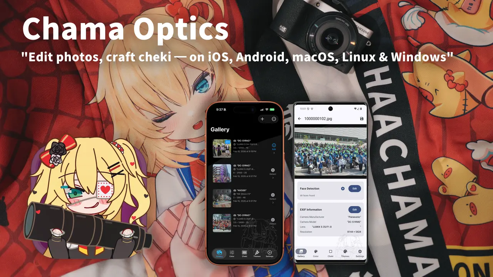

**Chama Optics** is a photo post-processing application that analyzes EXIF data from photos taken with DSLR/mirrorless cameras, applies various themed frames, and adds effects such as watermarks, mosaics, and stickers. The name "Chama" is derived from the nickname of travel VTuber Akai Haato (赤井はあと).

I've gone through countless mobile devices, but my interest has always been on the **making** side of electronics, and I was far from smartphone app development. As a fan of Hololive JP 1st Generation member Akai Haato (HAACHAMA), my otaku life led me to start my first project in a software development domain outside of embedded systems.

I first conceptualized this program in March 2025.
At the time, I wanted it to run as a web app, and I was testing libraries, the WASM environment, and porting libheif.
In August 2025, after attending Amane Kanata's solo live LOCK-ON in Tokyo, Japan, and the AnimeNYC World Tour + EN Concert (All for one) in New York, USA, I keenly felt the need to quickly organize photos, compress them to WEBP, and post them.
At the same time, Akai Haato had recently taken a liking to photography -- showing the camera she uses in membership-only posts and encouraging photo posting on [#推し活はあとん日記](https://x.com/hashtag/%E6%8E%A8%E3%81%97%E6%B4%BB%E3%81%AF%E3%81%82%E3%81%A8%E3%82%93%E6%97%A5%E8%A8%98) (Oshikatsu Haaton Diary). I wanted to develop an app under the Haato (HAACHAMA) name for her.

| Recent 3D Live | Akai Haato X(twitter) |
| ----------- | --------- |
|  |  |

When developing the program, I adhered to these principles:
- There must be no architectural discrimination across desktop platforms.
- It must be minimally tied to MS or Apple's development ecosystems.
- It must not use many resources and must be fast.

These goals might sound grandiose, but really I'm just a Rust enthusiast and that's why these are the goals.

---

## The Beginning: Making EXIF Frames Easier

I didn't plan a grand cross-platform app from the start.

Among camera enthusiasts, there's a culture of sharing photos with frames that display camera model, lens, shutter speed, and other information based on EXIF data. I enjoyed this practice too, and had been referencing a web-based tool called [exif-frame](https://github.com/jeonghyeon-net/exif-frame). However, I was frustrated by its lack of HEIF format support and limitations with high-resolution image output, so the idea to build it myself is what sparked Chama Optics.

Initially, I only considered **desktop use**. I had vague thoughts about mobile, but since I always carried my MacBook around even when traveling, mobile wasn't on my radar at all. Pulling the SD card from the camera, organizing photos on the MacBook, applying frames, and uploading -- that workflow was second nature.

---

## Change of Direction: "You Can't Take a Laptop at Concert Hall"

Two things prompted the change in direction.

### Cultural Differences at Events -- What I Noticed at AnimeNYC and East Asia

In August 2025, I visited the US for **AnimeNYC** and the **Hololive World Tour / EN Concert**. I noticed an interesting difference there. In the US, people tended **not to mosaic other people's faces** when posting event photos. But at events in Korea and Japan, **mosaicing other people's faces is considered proper etiquette and an unspoken rule**.


"Mosaicing other people's faces" is too tedious to do manually every time. Especially when you have dozens or hundreds of photos. The thought that **automatic face detection + mosaic/sticker functionality** was needed started to weigh heavily from this point.

### The Upcoming Hololive Expo

Another motivator was the **Hololive Expo/Festival in March 2026**. What if you could take photos at the venue, apply frames on the spot, process mosaics, and post to social media right there? But you can't open a MacBook at an event. **It had to be processable directly on a smartphone.**

### Requests from Others

On top of this, people around me started **requesting an iOS version**. So I started developing for iOS, and then **requests for an Android version** came in too.

This is how a desktop-only program expanded to support iOS and eventually Android. For mobile, the design direction shifted to consider the **general user experience** more than mirrorless camera users. The starting point of EXIF frames remained, but a new use case was added: "quickly processing and sharing photos on-site at events."

---

## Architecture: From Desktop to Mobile

Originally, I planned to build only a desktop app with Rust + egui. Writing all the core logic in Rust turned out to be a great decision. When expanding to iOS/Android, I was able to **reuse the core code for image processing, EXIF parsing, theme rendering, and encoding/decoding as-is**.

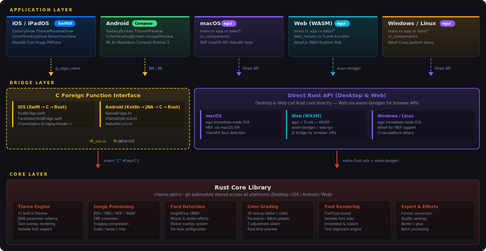

On desktop, the Rust core is used via **direct linking**. On iOS, it's **called from Swift via C FFI**. On Android, it's **called from Kotlin via JNA (Java Native Access)**. The Rust core is managed as a git submodule, and core features like EXIF interpretation, image overlays (text, EXIF, margins, scaling, encoding/decoding) are shared across all platforms.

However, face detection uses a different strategy per platform:
- **Desktop (macOS/Windows/Linux)**: ONNX Runtime + InsightFace (SCRFD det_10g) model. Depending on Speed Mode, a sliding window with a fixed 640x640 input size is applied in multiple stages (2560/1280/640) to detect even small faces, with NMS to remove duplicates.
- **iOS**: Uses Apple Vision Framework natively. Fast and accurate without ONNX models, and favorable for privacy.
- **Android**: Uses Google ML Kit (`com.google.mlkit:face-detection`) -- Google's on-device face detection library, mapping Rust core's speed_mode to FAST/ACCURATE performance modes.

---

## Why I Gave Up on the Web Version

I'm not well-versed in web apps or how the web and browsers work. Despite that, Chama Optics was initially **designed with Web (WASM) in mind.** Since egui supports WASM, I had a vague expectation that "desktop and web could work simultaneously." But I gave up after trying to implement these two features:

- **HEIF decoding**
- **Drag & Drop in egui Web**

### HEIF: WASM on Top of WASM, with JS in Between

Before the difficulty of running libheif in the browser, the fundamental architecture didn't make sense to me. libheif is already compiled to WASM, and the egui app is also WASM. The fact that communication between these two had to go through **JavaScript-based FFI multiple times** didn't sit right with me. Most cross-language FFI is done through C, so I couldn't understand why the JS ecosystem required this approach.

### Drag & Drop: A Desktop Developer's Expectations vs. Reality

Beyond Drag & Drop, I expected WASM to receive events from the browser in ways more typical of desktop/embedded development -- like receiving the DOM in binary form rather than through JS -- but that wasn't the case.

### Honestly, I Only Know C and Rust

I **only know C and Rust.** In other words, I'm either completely ignorant about web development, or I've done it in very bizarre ways in the past.

Once I had to display a large amount of data on the web, and since I didn't know how, I created the data as CSV, then used a **hex editor to do a bulk find-and-replace** of `,` and `\n` with HTML tags like `<div>` to create a static website and deployed it. With 25% of the 21st century already behind us, even I thought "what am I doing?"

Of course, since WASM is web technology, following the web ecosystem and its conventions is the norm. But since I'm not a web developer, I couldn't get on board. I was **very far removed from the JS/Web ecosystem**, and building native mobile apps felt far more natural than overcoming these fundamental differences in development philosophy. In v0.1.9-beta, I officially removed WASM support and directed that energy toward iOS/Android native development.

---

## Development Journey Through the Timeline

### v0.1.0\~v0.1.1 (2025-10-19\~21) -- First Pre-release


First binary release for macOS/Windows. Film theme frame, Japanese translation, batch save, filename prefix/suffix settings. macOS code-signed DMG distribution and Korean/English/Japanese installation guide wiki.

### v0.1.2\~v0.1.6 (2025-10-27\~11-24) -- Theme Expansion and Watermarks

| Film Date Theme | Strap Theme | Monitor Theme | Lightroom Theme |
|:---:|:---:|:---:|:---:|
|  |  |  |  |

Added Film Date/Film Glow/Just Frame/Strap/Monitor/Lightroom themes. Watermark (9 positions, opacity, blend mode), font selection (built-in + OS fonts), automatic camera manufacturer logo, HEIF orientation fix, initial variable font support, Longside scale option.

### v0.1.7 (2025-11-26\~12-19) -- CJK Rendering Improvements and Open-Source Contributions

| One Line Theme | Shot On Two Line Theme |
|:---:|:---:|
|  |  |

| Nikon PhotoStyle | Lumix Photo Style + LUT |
|:---:|:---:|
|  |  |

One Line/Two Line/Shot On themes. Major CJK glyph rendering improvements with SourceHanSans fallback built-in. Submitted a PR to [exif-rs](https://github.com/kamadak/exif-rs) to extract Lumix LUT and Nikon PhotoStyle names from EXIF, pre-applied before merge.

### v0.1.8 (2025-12-25\~27) -- UI Renewal and Performance Improvements

| Image List Tab | Theme Settings Tab |
|:---:|:---:|
|  |  |

Tab-based interface (4 tabs), EXIF variable auto-completion, automatic image grouping, 2MP MPF preview-based theme previews, Rayon multi-core parallel processing, system font loading memory issue fix. Also submitted a PR to [egui](https://github.com/emilk/egui).

### v0.1.9 (2026-01-18\~02-04) -- Face Detection, LUT, and First iOS Release

| Face Detection (Desktop) | Mosaic Applied |
|:---:|:---:|
|  |  |

| Color Grading UI | LUT Applied Result |
|:---:|:---:|
|  |  |

| iOS Gallery | iOS Editing |
|:---:|:---:|
|  |  |

The last desktop-only release and the first iOS app release. ONNX (InsightFace) face detection + mosaic/stroke/sticker overlays. 1D/3D LUT color grading ([wagahai-lut](https://github.com/pmnxis/wagahai-lut)). iOS uses SwiftUI + Vision Framework native face detection, with a Rust FFI bridge (`ffi_ios.rs` + `RustBridge.swift`). Indonesian translation added.

---

## Technical Challenges and Solutions

Let me first summarize the performance strategies applied throughout the project:

- **Rayon parallel processing** -- Multi-core utilization for batch image export. However, for pixel-level processing like color correction, parallelization with `par_chunks_exact_mut()` is applied only when the image exceeds 100,000 pixels; smaller images use sequential processing to avoid context-switching overhead.
- **`fast_image_resize`-based resizing** -- Instead of the `image` crate's default resize, SIMD-optimized `fast_image_resize` significantly improves thumbnail generation and preview resizing speed.
- **Lazy loading and caching** -- LUT files are parsed and cached in `lut_cache: HashMap<Uuid, CubeLut>` on first use, and EXIF thumbnails are lazy-loaded into `thumbnail_cache`. When cloning for background threads (`clone_for_thread()`), the cache is excluded to prevent unnecessary memory duplication.
- **Perceptual hash-based image grouping** -- On image load, an 8x8 grayscale average hash (64-bit) is pre-computed, enabling subsequent similar image grouping via Hamming distance O(1) comparison. Grouping is done using only metadata without reloading original images.
- **Build profile optimization** -- Release builds use `opt-level = 3`, `lto = "fat"`, `codegen-units = 1`. Even in Dev builds, performance-sensitive dependencies like `fast_image_resize`, `mozjpeg`, and `ab_glyph` are individually set to `opt-level = 3` to maintain image processing performance during debugging.

### 1. Cross-Platform FFI Complexity

Different FFI strategies were adopted to use the Rust core across three platforms (desktop/iOS/Android):

| Platform | FFI Method | Characteristics |
|:---|:---|:---|
| Desktop (egui) | Direct Linking | Rust to Rust, no FFI needed |
| iOS (SwiftUI) | C FFI (`@_silgen_name`) | Direct C function calls from Swift |
| Android (Compose) | JNA (Java Native Access) | .so invocation from Kotlin via JNA |

The main challenge was maintaining this bridge layer while ensuring stable memory management (string allocation/deallocation, opaque pointer handle patterns).

### 2. The Endless Variables of EXIF Parsing

EXIF recording methods differ across cameras:
- **Shutter speed / F-value floating-point issues** -- Cases where 1/125 sec is recorded as a messy value like `0.008000000`, requiring automatic correction
- **HEIF/HEIC orientation errors** -- Orientation being incorrect in some images
- **Cameras without lens information** -- Handling compact cameras like Nikon Coolpix
- **Information hidden in MakerNote** -- Parsing vendor-specific non-public EXIF fields like Lumix LUT names, Nikon PhotoStyle, Sony Creative Look

For this, I submitted PRs directly to the [exif-rs](https://github.com/kamadak/exif-rs) library to add the needed functionality.

### 3. MakerNote Parsing: Extracting Per-Manufacturer Shooting Settings

Recent mirrorless cameras have excellent built-in color grading features. Lumix's Photo Style, Nikon's Picture Control, Sony's Creative Look, and so on. Among photographers, "which color setting was used" is as important as the camera model or lens, and I thought it would be great to include this information in the frame.

The [EXIF standard](https://www.cipa.jp/std/documents/download_e.html?DC-008-Translation-2023-E)'s **MakerNote** (Tag 0x927C) is a non-standard area that camera manufacturers can use freely. The format differs between manufacturers -- and even between models from the same manufacturer -- and documentation is sparse. But it hides information important to photographers, like **"which color setting was used for the shot."**

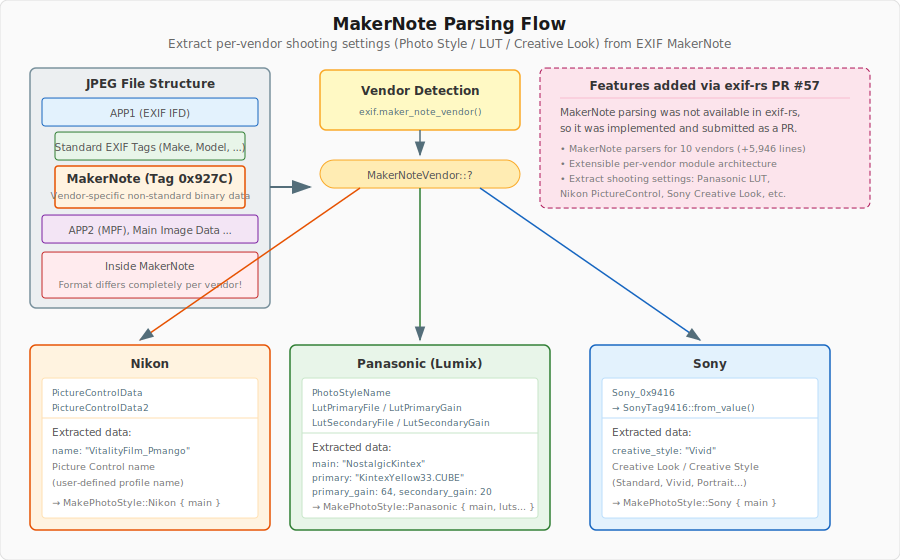

In Chama Optics, the manufacturer is first identified via `exif.maker_note_vendor()`, then dispatched to manufacturer-specific parsers.

**Nikon** -- Extracts Picture Control names from the `PictureControlData` / `PictureControlData2` tags. User-defined profile names like `"VitalityFilm_Pmango"` or preset names like `"Flat"`, `"Vivid"` are found here.

**Panasonic (Lumix)** -- Provides the richest data. Extracts the base Photo Style name (`"NostalgicKintex"`) from `PhotoStyleName`, and the applied LUT filename (`"KintexYellow33.CUBE"`) along with Gain values from `LutPrimaryFile`/`LutSecondaryFile`. This information directly connects to Chama Optics' LUT color grading feature.

**Sony** -- Extracts Creative Style/Creative Look information (`"Vivid"`, `"Standard"`, `"Portrait"`, etc.) from the `Sony_0x9416` tag.

This MakerNote parsing feature didn't exist in exif-rs, so I implemented it myself and submitted it as [PR #57](https://github.com/kamadak/exif-rs/pull/57).

#### EXIF IFD Entry Structure and MakerNote Offset Issues

To parse MakerNote, you first need to understand EXIF's IFD (Image File Directory) structure. EXIF data is based on the TIFF format, and each IFD entry is exactly **12 bytes**:

- **Tag** (2 bytes) -- Field identifier (e.g., `0x927C` = MakerNote)
- **Type** (2 bytes) -- Data type
- **Count** (4 bytes) -- Number of values
- **Value/Offset** (4 bytes) -- The value itself if data is 4 bytes or less; otherwise, an **offset pointing to the data's location**

In standard EXIF, this offset is the **distance from the TIFF header start**. Simple and straightforward. But within MakerNote's internal IFD, this rule breaks down.


**Here's the problem**: MakerNote also contains entries with the same structure as IFD entries, but the reference point for offsets -- "distance from where?" -- **differs by manufacturer.**

- **TIFF-Relative method** (Panasonic, Canon, Sony, Leica, Sigma) -- Offsets inside MakerNote are relative to the original TIFF header start. The MakerNote itself has no TIFF header, and you need to subtract `tiff_offset` (distance from TIFF start to MakerNote) from the offset to find the actual data location.
- **MakerNote-Relative method** (Nikon, Olympus, Fujifilm, Samsung, Apple, Pentax) -- Offsets inside MakerNote are relative to the MakerNote start. Self-contained structure; Nikon even has its own TIFF header inside the MakerNote.

Additionally, byte order (endianness) also differs by manufacturer. Nikon uses its own TIFF header, Olympus/Apple use `"II"`/`"MM"` bytes in the proprietary header, and Samsung auto-detects from IFD tag number patterns.

In the end, I implemented header format, offset correction formulas, and byte order detection logic for 10 manufacturers (Panasonic, Nikon, Sony, Canon, Olympus, Fujifilm, Samsung, Apple, Sigma, Pentax), resulting in a PR of 23 files and approximately 5,900 lines.

### 4. Camera Manufacturer Logo System: CSV to build.rs to Binary Embedding

To automatically insert **camera manufacturer logos** into photo frames for themes like Strap and Film, two things are needed: (1) identifying the manufacturer from EXIF, and (2) rendering that manufacturer's SVG logo.

#### Compile Time: SVG Download & Embedding from CSV

I previously covered approaches for [maximizing work at compile time with `const fn`/`const impl`](/ko/posts/my_first_commerical_rust_embedded_product_3/) and [`build.rs` build script techniques](/ko/posts/my_first_commerical_rust_embedded_product_4/) in a Rust Embedded mass-production project. Chama Optics' logo system builds on that experience, extensively using `build.rs` + `include_bytes!()`.


`assets/logo_mnf.csv` defines logo information for 35 manufacturers. When `cargo build` runs, `build.rs` reads this CSV and performs the following:

1. **SVG Download** -- Fetches SVGs from the `url` column of each row. For Wikimedia Commons URLs, it downloads via HTTP; for local paths (`assets/logo_mnf/contax.svg`), it reads directly. On network failure, it retries up to 3 times with 5-second intervals.
2. **MD5 Hash Verification** -- Compares the MD5 hash of the downloaded file against the `expected_md5` value in the CSV. **If the file already exists and the hash matches, the re-download is skipped.** If the hash doesn't match, it `panic!`s to halt the build -- because if the SVG changed on Wikimedia's end, it needs to be intentionally reviewed.
3. **Rust Code Generation** -- Generates `assets/auto_generated/logo_assets.rs`, embedding each SVG into the binary via `include_bytes!()`. No file loading is needed at runtime.

```rust
// Example of auto-generated code
pub const LOGO_ASSETS: &[ArtAsset] = &[
    ArtAsset {
        key: "canon.svg",
        data: include_bytes!(".../assets/download/canon.svg"),
        color_type: ColorType::Color,
        mnf: "canon", model: "",
        mnf_model_rel: MnfRelation::Any,
    },
    // ... 35 manufacturers
];
```

#### Runtime: EXIF to Logo Matching to SVG Rasterization


When a photo is loaded, `Tag::Make` (manufacturer) and `Tag::Model` (model name) are extracted from EXIF, and the `LOGO_ASSETS` array is iterated for matching.

There are two matching rules:
- **`MnfRelation::Any`** -- Either the manufacturer name **or** model name needs to match (most cases)
- **`MnfRelation::Both`** -- Both the manufacturer name **and** model name must match (special cases)

A real-world case where `Both` is needed: **Sigma** changed its logo in 2025. The only camera using the new logo is the `SIGMA BF` model, so `sigma2025.svg` (new logo) is registered in the CSV as `mnf="sigma", model="sigma bf", mnf_model_rel=Both`, while other Sigma cameras use `sigma.svg` (old logo) with `mnf="sigma", mnf_model_rel=Any`.

The matched SVG is parsed with `usvg`, rasterized with `resvg`+`tiny-skia`, and composited at the appropriate position and size within the frame. Rendering behavior varies based on `color_type` (Black/Color) and `fill_ops` (Default/Monochrome), allowing logo rendering that matches the background color.

### 5. CJK Font Rendering and Variable Font Optimization

Numerous issues arose when rendering Japanese, Korean, and Chinese text on images:
- Some CJK ideographs failing to render
- Glyph widths being incorrect with variable fonts

The solution was to **embed SourceHanSans as a built-in fallback font**, automatically substituting glyphs unsupported by the selected font. Specifically, the text is iterated character by character, and when the primary font returns `GlyphId(0)` (no glyph), rendering switches to the SourceHanSans fallback font.

#### Variable Font Weight Remapping

The primary font used in Chama Optics, **BarlowGX.ttf**, is a variable font, but its internal weight axis values used a non-standard range of **22 to 188**. This didn't match the **100 to 900** range used by CSS standards, FreeType, etc., so specifying Regular weight with `ab_glyph`'s `set_variation(b"wght", 400.0)` didn't produce the intended result. Additionally, the default width was set to wdth=300 (Condensed), causing glyph widths to be wrong too.

I thought simply modifying `fvar` (Font Variations metadata) would suffice, but the `hmtx` table holding actual glyph widths was still based on Condensed metrics. **Changing only the metadata doesn't change the rendering result.** Ultimately, I extracted 9 weight instances from BarlowGX.ttf at wdth=500 (Regular width), used them as master sources, and completely rebuilt the variable font with `fontTools.varLib.build()`. The results are `Barlow-Variable-Remapped.ttf` and `Barlow-Variable-Remapped-Narrow.ttf`.

#### Merging Multiple Font Files into One -- Absolute File Size Reduction

Another advantage of variable fonts is the ability to **merge multiple weight files into one**. Where previously 9 or more static font files were needed (Barlow-Thin.ttf, Barlow-Light.ttf, Barlow-Regular.ttf, Barlow-Bold.ttf, Barlow-Black.ttf, etc.), a single variable font can replace them all.

The same applies to CJK fonts. SourceHanSans (the ideal choice for Japanese, Korean, and Chinese characters) originally ships as separate files per weight, but using the variable font version (`SourceHanSansVF`) covers all weights from 200 to 800 in a single file. However, this font had the same issue as BarlowGX, so I remapped the weight axis to the standard range to produce `SourceHanSansVF-remapped.otf`.

Going further, I used `fontTools` to **merge fonts with different character sets into one**. Latin fonts + Japanese fonts + Korean fonts can be combined into a single file, and by combining WOFF2 decompression, TTC (Font Collection) processing, instance extraction at specific weights, and UTF-8-based character subsetting, the final file size was minimized.

The final font files embedded in Chama Optics are:

| Font | Static Font Size | Variable Font Size | Savings |
|:---|---:|---:|:---|
| `Barlow-Variable-Remapped.ttf` (100~900) | ~1.35 MB (9 weights) | **385 KB** | **~3.5x** |
| `Barlow-Variable-Remapped-Narrow.ttf` (100~900) | ~1.45 MB (9 weights) | **207 KB** | **~7x** |
| `SourceHanSansVF-remapped.otf` (200~800) | ~105 MB (7 weights) | **30 MB** | **~3.5x** |
| `DejaVuSansMono.ttf` (static) | -- | 327 KB | -- |
| `digital-7.ttf` (static) | -- | 34 KB | -- |
| **Total** | **~108 MB** | **~31 MB** | **~3.5x** |

The Barlow case is especially dramatic. The original Barlow project contains 9 weights x 3 widths x 2 (upright+italic) = 54 static TTF files totaling **8.5 MB**, while the two variable fonts needed for Chama Optics (normal + narrow) total just **592 KB**. In a mobile app bundle size-sensitive environment, this difference is decisive.

#### Variable Font Weight Selection in egui

In the desktop version (egui), the variable font weight can be **freely adjusted by the user**. The key is the `set_variation` API from the `ab_glyph` crate:

```rust
pub struct VariableFontPack {
    pub label: &'static str,
    pub font: ab_glyph::FontRef<'static>,
    pub default: u16,       // Default weight (e.g., 300)
    pub start: u16,         // Minimum weight (e.g., 100)
    pub end_include: u16,   // Maximum weight (e.g., 900)
}

impl VariableFontPack {
    pub fn get_font_by_weight(&self, weight: u16) -> ab_glyph::FontArc {
        let clamped = weight.clamp(self.start, self.end_include);
        let mut font = self.font.clone();
        font.set_variation(b"wght", clamped as f32);
        font.into()
    }
}
```

When the user adjusts the weight slider in theme settings, `set_variation(b"wght", weight)` is called with that value to change the font weight at runtime. Continuous values from 100 (Thin) to 900 (Black) can be specified, and intermediate values like 350 or 450 are interpolated for smooth weight transitions.

This logic works identically across desktop, iOS, and Android. On iOS, `FontSelectionView` displays a weight slider only for variable fonts and passes the selected weight value to the Rust core via FFI. Android follows the same structure, passing the `fontWeight` parameter to Rust FFI from Kotlin.

CJK fallback also respects the weight. When the primary font is Barlow weight 700 (Bold) and a CJK character appears, SourceHanSans is rendered at a weight close to 700 so that **Latin and CJK character weights appear consistent**.

#### Built-in Fonts and System Fonts

Fonts used in Chama Optics fall into two categories: **built-in fonts** and **system (OS) fonts**.

Built-in fonts are bundled with the app by default: Barlow (Latin), SourceHanSans (CJK fallback), D2Coding (monospace), Digital-7 (segment display style), etc. System fonts allow users to select from fonts installed on their OS for use in themes. Since users need to be able to freely choose the font for text displayed on EXIF frames, built-in fonts alone aren't sufficient.

**On desktop, fonts are embedded in the binary via `include_bytes!`**:

```rust
pub(crate) const FONT_BARLOW: BuiltInFonts = BuiltInFonts {
    name: "Barlow",
    data: include_bytes!("../../assets/fonts/Barlow-Variable-Remapped.ttf"),
};
```

Desktop distributes as a single executable for convenience, so font files are included in the binary at compile time. It runs immediately with just the executable, no separate font directory needed.

On the other hand, **iOS/Android load fonts dynamically via file paths**. Mobile apps are sensitive to binary size, and separating resource files within the app bundle is also platform convention. Swift/Kotlin passes the font directory path to the Rust core via FFI, and Rust reads the files at the appropriate time using `std::fs::read()`.

System fonts are supported on desktop only. `font-kit` crate's `SystemSource` enumerates OS-installed fonts, and the user's selected font is loaded. This work is performed on a background thread to avoid blocking the UI, shared thread-safely via `Arc<RwLock<Vec<SystemFont>>>`.

#### Debugging font-kit macOS Memory Explosion

After implementing system font enumeration, a serious problem appeared on macOS. **Memory usage shot up to 1.0GB, peaking at 1.5GB** immediately after app launch. ([#5](https://github.com/pmnxis/chama-optics/issues/5))

Tracing with `MallocStackLogging` and `malloc_history` revealed the cause was in `font-kit`'s macOS backend (`core_text`). `font_kit::SystemSource::all_fonts()` was **reading the entire file data of each font into memory** while enumerating system fonts:

```
435 calls for 2045941700 bytes:  <- ~2GB
  font_kit::sources::core_text::create_handles_from_core_text_collection
    font_kit::utils::slurp_file    <- reads entire font file into memory
      alloc::raw_vec::RawVecInner::try_allocate_in
```

macOS has hundreds of system fonts installed, and CJK fonts (like Apple SD Gothic Neo, Hiragino, etc.) can be tens of MB each. `slurp_file` was loading all of them into memory, allocating about 2GB for 435 fonts. (On Windows, the same code used about 90MB.)

The fix was to fork `font-kit` and modify `all_fonts()` to **collect only metadata (name, path) without reading font data**. After the fix, memory usage dropped dramatically to **144.9MB** (peak 389.4MB).

### 6. LUT Color Grading: wagahai-lut's Optimization Philosophy

The library name comes from a tweet by [wagahaida_L (Laplus Darkness)](https://x.com/wagahaida_L).

| LaplusDarknesss | wagahaida_L |
| ---------- | ---------- |
|  |  |

> As an aside, the cheki-style (Polaroid-style) automatic image generation feature being prepared for v0.2.0 was also inspired by Laplus Darkness. I think she's cunningly clever.

The LUT color grading feature added in v0.1.9 uses the self-developed [wagahai-lut](https://github.com/pmnxis/wagahai-lut) ([crates.io](https://crates.io/crates/wagahai-lut)) library.

#### What is a CUBE LUT?

A CUBE LUT (Look-Up Table) is a [`.cube` file format defined by Adobe](https://web.archive.org/web/20220220033515/https://wwwimages2.adobe.com/content/dam/acom/en/products/speedgrade/cc/pdfs/cube-lut-specification-1.0.pdf) that contains color transformation data. There are two types: 1D LUT and 3D LUT.

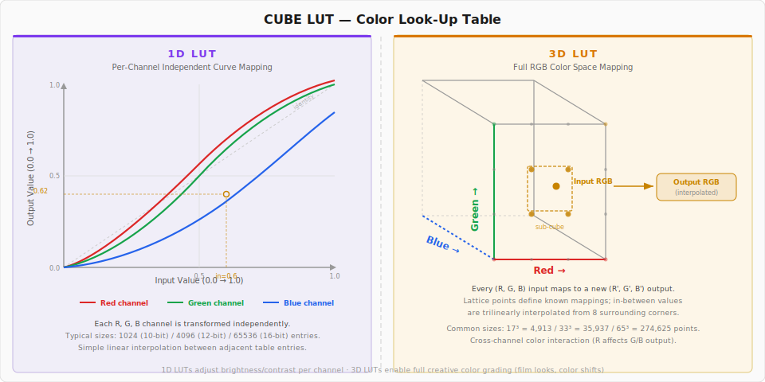

A **1D LUT** transforms each R, G, and B channel independently. It's a simple structure that looks up input values in a table and converts them to output values. Suitable for brightness/contrast adjustment, but cross-channel interactions (e.g., converting red to blue) are impossible. Table sizes are typically 1,024 (10-bit) to 65,536 (16-bit) entries, with values between adjacent entries calculated via linear interpolation.

A **3D LUT** maps the entire RGB 3D color space. Input (R, G, B) can be transformed to a completely different (R', G', B'), making it useful for creative color grading in film/photography (film look, color grading). Lattice points within the cube define known mappings, and values between lattice points are calculated via **trilinear interpolation** from the 8 surrounding vertices. Common sizes are 17^3 (4,913 points), 33^3 (35,937 points), and 65^3 (274,625 points).

#### wagahai-lut's Optimization Strategy

Existing Rust LUT libraries focused on generality. wagahai-lut was optimized from memory layout to SIMD level to meet Chama Optics' requirement: "batch processing dozens of 24MP photos must be fast." However, since both x86_64 and ARM64 need to be supported, instead of writing assembly directly, I used the [`wide`](https://crates.io/crates/wide) crate for architecture-agnostic vector optimizations.

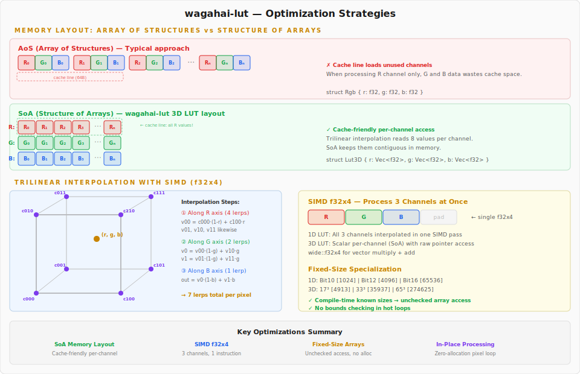

**1) Structure of Arrays (SoA) Memory Layout**

Typical 3D LUT implementations use an AoS (Array of Structures) layout: `[Rgb, Rgb, Rgb, ...]`. But trilinear interpolation needs to read 8 vertex values one channel at a time, so in AoS, unnecessary channel data gets loaded into the cache line alongside the needed data.

wagahai-lut stores 3D LUTs as three separate arrays: `r: Vec<f32>`, `g: Vec<f32>`, `b: Vec<f32>`. Thanks to this SoA layout, the 8 values needed for one channel's interpolation are close together in memory, resulting in higher CPU cache hit rates.

**2) SIMD Parallel Processing (`wide::f32x4`)**

For 1D LUT processing, `wide` crate's `f32x4` SIMD vectors perform linear interpolation of all three R, G, B channels in a **single vector operation**. Three of the four lanes are assigned to R, G, B, with multiplication and addition handled in a single instruction.

**3) Fixed-Size Specialization**

1D LUTs use `Box<[Rgb; SIZE]>` fixed-size arrays for common sizes: `Bit10(1024)`, `Bit12(4096)`, `Bit14(16384)`, `Bit16(65536)`. Since the size is determined at compile time, bounds checking can be bypassed with direct `get_unchecked()` access. 3D LUTs also provide separate types for common sizes like 17^3, 33^3, and 65^3.

**4) In-Place Processing and Loop Optimization**

The `apply_rgb_mut()` / `apply_rgba_mut()` functions modify image buffers in-place with zero additional memory allocation. In hot loops, the domain range inverse (`inv_domain_range`) is pre-computed outside the loop, raw pointer arithmetic eliminates `get_pixel()`/`put_pixel()` call overhead, and byte slices are traversed linearly to maximize CPU cache prefetching.

#### Benchmark Results

Processing times on M4 Max (Stable Rust), including JPEG decode/encode:

| Resolution | 1D LUT | 3D LUT |
|:---|---:|---:|
| 1920x1080 (FHD) | 14.39 ms | 19.40 ms |
| 6000x4000 (24MP) | 159.91 ms | 223.15 ms |
| 8144x5424 (44MP) | 294.34 ms | 417.09 ms |

At about 0.22 seconds for 3D LUT processing of a 24MP photo, combined with Rayon parallelization, practical speed is achieved when batch-processing dozens of photos in Chama Optics.

### 7. Desktop Face Detection: Speed Mode and Sliding Window Algorithm

The desktop version uses ONNX Runtime + InsightFace (det_10g) model. This model's input size is a **fixed 640x640 pixels**. But actual photos are mostly 24MP (6000x4000) or larger, and if the entire image is scaled down to 640x640, faces in group photos where people are photographed small will be missed.

To solve this, a **multi-stage sliding window algorithm based on Speed Mode** was implemented.

| Mode | max_depth | Depth Loop Window Size | Overall Behavior |
|:---|:---:|:---|:---|
| Fastest | 0 | (none) | Full image -> 640x640 resize -> single inference |
| Fast | 1 | (none, depth loop not executed) | + Short-side (`min(W,H)`) sliding window |
| Normal | 1 | 640x640 | + 640x640 fine-grained window |
| Slow | 2 | 1280x1280 -> 640x640 | + 1280->640 multi-stage window |
| Slowest | 3 | 2560x2560 -> 1280x1280 -> 640x640 | + 2560->1280->640 full multi-stage window |

> **Depth Loop window size formula**: `window = 640 x 2^(max_depth - depth - 1)`
>
> Example: Slowest (max_depth=3) -> depth 0: 2560, depth 1: 1280, depth 2: 640

The algorithm flow is as follows:

1. **Stage 1 (common)**: Resize the full image to 640x640 for a single inference. Large faces are caught at this stage.
2. **Stage 2 (Fast and above)**: Move a sliding window of size equal to the image's short side (`min(width, height)`) with 10% overlap, resizing each window to 640x640 for inference. Prevents misses in unusual aspect ratios (panoramas, etc.).
3. **Stage 3 (Normal and above)**: Iterate through windows of size `640 x 2^(max_depth - depth - 1)` per depth. Slowest uses 2560->1280->640, Slow uses 1280->640, Normal uses a single 640 depth.
4. **Final**: Remove duplicate detections with NMS (Non-Maximum Suppression, IoU threshold 0.4).

Diagrams visualizing each Speed Mode's behavior (based on a 6000x4000 source image):

#### Fastest

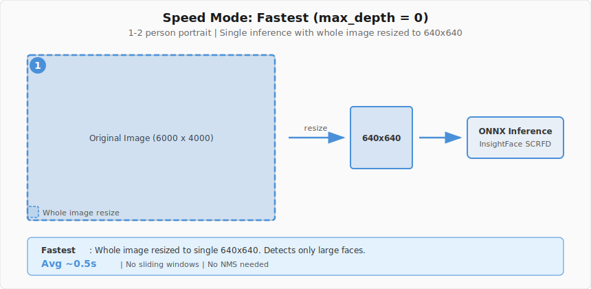

#### Fast


#### Normal

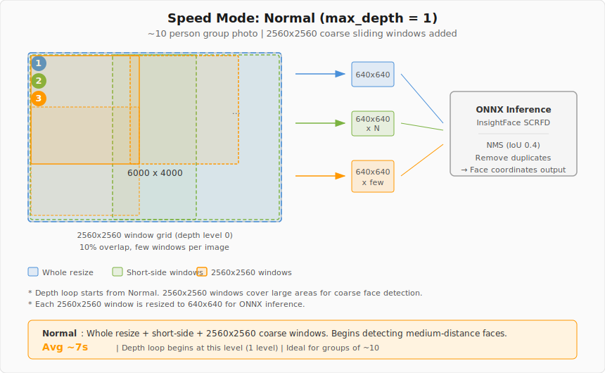

#### Slow

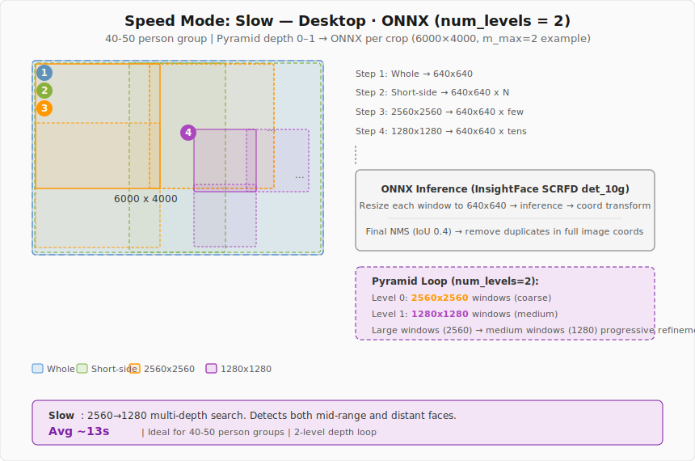

#### Slowest

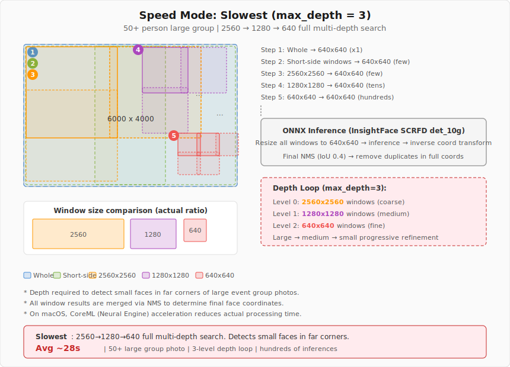

Below is an example of an actual event photo processed in Slowest mode. Even small faces in the back corners of large group photos are detected without exception and mosaic-processed.

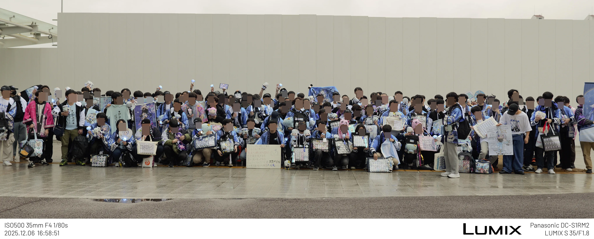

> 2025 AGF Amane Kanata fan group photo session

Usage scenarios for each mode:

| Mode | Average Processing Time | Suitable Situation |
|:---|:---|:---|
| Fastest | ~0.5 sec | 1-2 person portraits |
| Fast | ~0.6 sec | 1-2 person photos with unusual aspect ratios like panoramas |
| Normal | ~7 sec | Group photos of about 10 people |
| Slow | ~13 sec | Group photos of 40-50 people |
| Slowest | ~28 sec | Large group photos of 50+ people |

Fastest scales the entire image to a single 640x640 and finishes in ~0.5 seconds, while Slowest takes ~28 seconds as it scans with overlapping windows at three stages (2560/1280/640). But capturing even small faces in the back corners of event group photos requires this level of scanning.

Execution providers are also optimized per platform:

- **macOS/iOS**: CoreML Execution Provider auto-selected -- leveraging Apple's Neural Engine/GPU acceleration
- **Windows/Linux**: CPU or OnnxAuto (auto-detection)

On macOS, even if the user selects CPU, it's internally switched to CoreML to **leverage Apple Silicon's Neural Engine**. This provides several times the performance improvement over CPU.

Meanwhile, iOS and Android use each platform's native face detection API instead of this ONNX pipeline:
- **iOS**: Apple Vision Framework -- fast and accurate without ONNX models
- **Android**: Google ML Kit (`com.google.mlkit:face-detection`) -- FAST/ACCURATE performance modes mapped to Rust core's speed_mode (Fastest/Fast -> FAST performance, Slow and above -> ACCURATE performance)

### 8. iOS Native Integration

The iOS app doesn't merely wrap the Rust core -- it maximizes the platform's strengths:
- **Vision Framework** -- Native iOS face detection for fast and accurate recognition without ONNX models
- **PhotosUI** -- Direct image selection from the iOS photo library
- **Metal rendering** -- GPU-accelerated image processing
- **iPad support** -- Layout optimized for the larger screen

### 9. MPF and Embedded Preview Image Extraction

Extracting sub-images hidden inside JPEG files plays a decisive role in Chama Optics' performance. This feature was implemented as [exif-rs PR #58](https://github.com/kamadak/exif-rs/pull/58) ([+1,364 lines](https://github.com/kamadak/exif-rs/pull/58), based on PR #57).

#### Images Hidden Inside a JPEG

A single JPEG file can actually contain multiple images.


Images embedded inside a JPEG can be extracted from three sources:

1. **EXIF IFD(1) Thumbnail** -- Standard EXIF thumbnail (usually 160x120)
2. **APP2 Segment (MPF)** -- Multi-Picture Format defined in the [CIPA DC-007](https://www.cipa.jp/std/documents/download_e.html?DC-007-Translation-2021-E) standard. Stored as separate complete JPEG streams after the main EOI.
3. **MakerNote Internal Preview** -- Vendor-specific non-standard preview images

#### Why MPF Previews Matter: Memory and Performance

When showing thumbnails in a photo list, the simplest approach is to **load the original image and then resize it**. But this is horribly inefficient.

| Method | Memory Usage | Processing Time |
|:---|:---|:---|
| Load original (24MP) -> resize | ~72MB (24M x 3bytes) | Slow |
| Use IFD(1) thumbnail | ~76KB (160x120) | Fast, but too small and blurry |
| **Use MPF preview (~2MP)** | **~8MB** | **Fast, and visually sufficient** |

IFD(1) thumbnails are too small -- fine for list views but blurry for previews. Loading originals means a 24MP image occupies ~72MB in memory with long decoding times. **MPF's 1-2MP preview images** are the sweet spot -- visually sharp enough while keeping memory and CPU overhead at less than 1/10 of the original.

Especially for a program like Chama Optics that needs to **show dozens of photos simultaneously in a list with theme previews**, this difference is decisive. Loading 50 24MP photos as originals would take ~3.6GB; loading MPF previews takes ~400MB -- roughly a 9x difference.

To avoid impacting existing exif-rs users, this was provided behind the `mpf` feature flag.

### 10. HEIF/HEIC Decoder: Per-Platform Strategy

Beyond JPEG, more devices are saving photos in HEIF (High Efficiency Image Format). iOS in particular uses HEIF by default when shooting, and the OS itself decides whether to convert to JPEG or keep HEIF when transferring photos externally -- it's not easy for apps to control this. Some mirrorless cameras (Sony, Canon, etc.) have also started supporting HEIF shooting. While some users stick to JPEG for compatibility, failing to handle HEIF files is fatal for a photo app. The problem is that HEIF decoding support varies widely across platforms.

Chama Optics adopted the strategy of **using OS native decoders wherever possible, and only using libheif on platforms without native support**.


**iOS/macOS** -- Apple's ImageIO framework natively supports HEIF. Decoding is possible using only the OS API without external libraries. On iOS, the decoded pixel buffer is passed from the Swift app layer to Rust via C FFI; on macOS, Rust calls macOS API bindings directly.

**Android** -- API 26 (Android 8.0) and above natively support HEIF via BitmapFactory and MediaCodec. The Kotlin app decodes and passes the result to Rust via JNA.

**Windows/Linux** -- No native HEIF decoder, or it's limited. In this case, [libheif_rs](https://crates.io/crates/libheif-rs) (Rust bindings for libheif) is used. Since libheif_rs handles C FFI internally, Rust code only calls safe APIs. libheif internally uses libde265 (HEVC decoder) and libaom (AV1/AVIF).

The key to this strategy is `#[cfg(target_os)]` conditional compilation. Platforms with native decoders get optimal performance with no external dependencies, and libheif_rs is linked only on platforms that need it. As a result, libheif-related code isn't even compiled in macOS builds.

### 11. Theme Parameter System: Rust to JSON to Platform-Specific UI

Chama Optics themes have over 40 configuration parameters -- font weight, watermark position/opacity, frame style, logo visibility, colors, margins, and more. The core requirement was that these parameters must produce **identical results** on desktop and mobile.

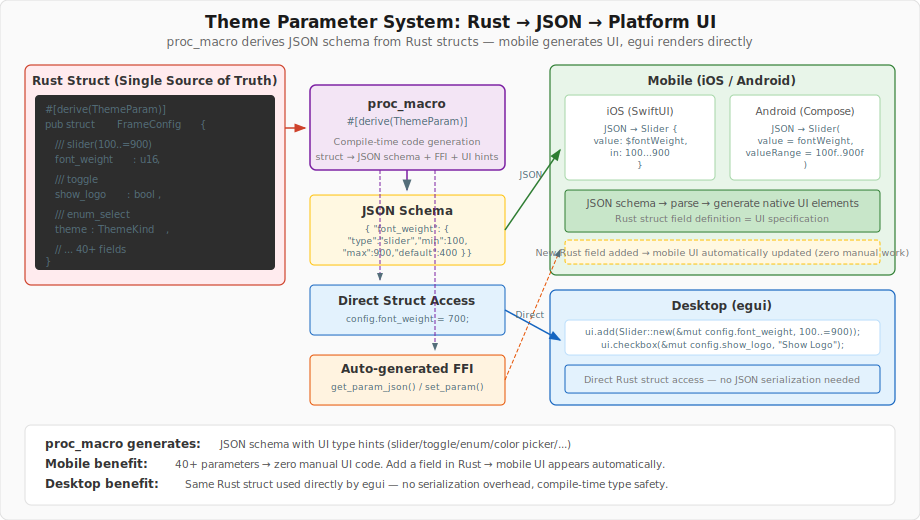

On desktop (egui), Rust structs are **directly referenced** to draw UI widgets. Code like `Slider::new(&mut config.font_weight, 100..=900)` means the struct field is the UI state -- no JSON serialization, no intermediate conversion.

The problem is mobile. iOS (SwiftUI) and Android (Jetpack Compose) can't directly access Rust structs. If we manually built UI for each of the 40+ parameters on the Swift/Kotlin side and wrote FFI code to pass values back and forth for each one? Every time a parameter is added, Rust, Swift, and Kotlin would all need simultaneous modifications.

I solved this with `proc_macro`. When `#[derive(ThemeParam)]` is added to a Rust struct definition, the following is auto-generated at compile time:

- **JSON schema**: JSON containing each field's UI type (slider, toggle, enum selector, color picker, etc.), range, and default values
- **FFI functions**: C ABI functions callable from mobile, such as `get_param_json()`, `set_param()`
- **Deserialization logic**: Code that applies JSON-received values to the Rust struct

The mobile app parses this JSON to **dynamically generate native UI elements**. `"type": "slider"` becomes SwiftUI's `Slider`, Jetpack Compose's `Slider()`. `"type": "toggle"` becomes `Toggle` / `Switch`. When the user changes a value, it's passed to the Rust core via FFI, and the Rust core returns results through the same rendering pipeline.

As a result, a single Rust struct simultaneously serves as **UI specification, data model, and serialization format**. When adding a new parameter, just add a field to Rust and annotate it with UI hints -- the proc_macro updates the JSON schema, and the mobile app automatically displays the corresponding UI on the next build. No Swift/Kotlin code modifications needed.

The `build.rs` overuse and `const fn` obsession from embedded development found its application here. Honestly, I'm not sure if using proc_macro for this is clean -- even I think it's "grotesque." But **it's definitely better than manually synchronizing 40+ parameters across 3 platforms.** For those wanting to learn more about Rust's procedural macros, [this article](https://priver.dev/blog/rust/procedural-macros/) is a good reference.

### 12. Multilingual Translation System: Auto-Generating Translations for 3 Platforms from a Single YAML

Supporting 4 languages (English, Korean, Japanese, Indonesian) while **keeping translation strings synchronized across 3 platforms.** If you had to manually edit iOS's `.strings`, Android's `strings.xml`, and the desktop's Rust code every time you add or modify a translation key? You'd inevitably miss something or fall out of sync.

The solution is simple. **Use YAML files in rust-core as the single source of truth, and automatically convert them to each platform's format at build time.**


#### YAML: The Source of Truth

There are 23 YAML files in the `rust-core/locales/` directory. They're split by feature -- `common.yml`, `gallery.yml`, `theme.yml`, `face_detection.yml`, etc. -- totaling approximately 3,900 lines.

```yaml
# rust-core/locales/gallery.yml
gallery:
  empty_state_title:
    en: "No Images Yet"
    ko: "이미지 없음"
    ja: "画像がありません"
    id: "Belum Ada Gambar"
```

This structure matches the format required by the `rust_i18n` crate exactly. On desktop, `rust_i18n::i18n!("locales")` embeds the YAML at compile time, and `t!("gallery.empty_state_title")` is called at runtime. No separate conversion needed. Since `cargo:rerun-if-changed=locales` is declared in `build.rs`, modifying YAML triggers automatic recompilation.

The problem is iOS and Android.

#### iOS: generate_ios_strings.sh

iOS uses `NSLocalizedString` and `.strings` files. `generate_ios_strings.sh` parses YAML using Python3 + PyYAML and generates per-locale `Localizable.strings`.

```bash
# Automatically called from build_ios.sh
./generate_ios_strings.sh
```

It flattens the YAML hierarchy into dot notation for the `.strings` format.

```
/* Auto-generated from rust-core/locales - DO NOT EDIT */
"gallery.empty_state_title" = "이미지 없음";
"common.actions.save" = "저장";
```

There were also iOS-specific requirements. Sometimes the same key needs different phrasing on iOS -- for example, where desktop says "Load file," iOS should say "Select photo" for a more natural feel. To handle this, I implemented **`_ios` suffix overrides**. If `import.label_ios` is defined in YAML, the iOS build uses that value instead of `import.label`. Desktop and Android are unaffected.

This script is automatically called from `build_ios.sh` before Rust cross-compilation, so editing YAML and running an Xcode build automatically reflects the translations.

#### Android: generate_android_strings.sh

Android uses `strings.xml` and the `R.string.*` resource system. There are two key differences.

**First, the key format is different.** Android resource names cannot use dots (`.`). YAML's `gallery.empty_state_title` must be converted to `gallery_empty_state_title` for Android.

```python
def yml_key_to_android_key(yml_key):
    return yml_key.replace('.', '_')
```

**Second, the locale directory conventions differ.** Android represents Indonesian as `in` instead of `id` -- `values-in/strings.xml`. The script handles this mapping.

```bash
ANDROID_LOCALE_MAP["en"]="values"
ANDROID_LOCALE_MAP["ko"]="values-ko"
ANDROID_LOCALE_MAP["ja"]="values-ja"
ANDROID_LOCALE_MAP["id"]="values-in"    # Android uses "in" for Indonesian
```

Another difference from the iOS script is that it uses **diff-based synchronization**. While iOS overwrites files entirely each time, the Android script leaves already-existing keys untouched and **only adds missing keys**. This preserves entries managed manually on the Android side (like app names). Running with `--check` mode reports missing translations without modifying files.

When actually using these keys in Android, `ThemeI18n.kt` maps YAML dot-notation keys to `R.string.*` resource IDs.

```kotlin
object ThemeI18n {
    fun translate(context: Context, key: String): String {
        val resourceId = keyToResourceId(key)
        return if (resourceId != 0) context.getString(resourceId) else key
    }
}
```

#### Key Conversion Comparison Across Three Platforms

| Element | Desktop (Rust) | iOS (Swift) | Android (Kotlin) |
|:---|:---|:---|:---|
| **Source** | `t!("gallery.empty_state_title")` | `NSLocalizedString("gallery.empty_state_title")` | `R.string.gallery_empty_state_title` |
| **Key separator** | `.` (dot) | `.` (dot) | `_` (underscore) |
| **Generation method** | Compile-time embedding | Build script auto-generation | Build script diff sync |
| **Platform override** | — | `_ios` suffix | — |
| **Indonesian code** | `id` | `id` | `in` |

Thanks to this structure, **editing a single YAML file** reflects changes across all three platforms. Manually synchronizing 23 YAML files, 4 languages, and 3 platforms is practically impossible -- automation was the only approach I could think of.

---

## Open-Source Contributions

Throughout the development of Chama Optics, I actively contributed to the open-source projects it depends on.

| Project | Contribution |
|:---|:---|
| [exif-rs](https://github.com/kamadak/exif-rs) | MakerNote parsing -- 10 manufacturer support ([PR #57](https://github.com/kamadak/exif-rs/pull/57), +5,946 lines) |
| [exif-rs](https://github.com/kamadak/exif-rs) | MPF and embedded preview image extraction ([PR #58](https://github.com/kamadak/exif-rs/pull/58), +1,364 lines) |
| [exif-rs](https://github.com/kamadak/exif-rs) | TIFF field access improvements ([PR #51](https://github.com/kamadak/exif-rs/pull/51), approved) |
| [font-kit](https://github.com/servo/font-kit) | Fix macOS system font enumeration memory explosion ([PR #271](https://github.com/servo/font-kit/pull/271)) |
| [egui](https://github.com/emilk/egui) | Improve main weight setting on variable font load ([PR #7790](https://github.com/emilk/egui/pull/7790), approved) |
| [wagahai-lut](https://github.com/pmnxis/wagahai-lut) | 1D/3D LUT color grading library ([crates.io](https://crates.io/crates/wagahai-lut)) |

---

## Release Summary

| Version | Date | Major Changes |
|:---|:---|:---|
| v0.1.0 | 2025-10-19 | First pre-release, macOS/Windows, Film theme |
| v0.1.1 | 2025-10-19 | Japanese translation, batch save, prefix/suffix |
| v0.1.2 | 2025-10-27 | Glow effect, Film Date/Glow themes |
| v0.1.3 | 2025-11-03 | Watermark (9 positions), font selection |
| v0.1.4\~5 | 2025-11-05\~12 | Just Frame, Strap themes, camera logos |
| v0.1.6 | 2025-11-24 | Monitor, Lightroom themes, Longside scale |
| v0.1.7 | 2025-12-19 | One/Two Line, Shot On themes, CJK fix, PhotoStyle |
| v0.1.8 | 2025-12-27 | Tab UI, grouping, theme preview, multi-core |
| v0.1.9 | 2026-02-04 | Face detection, LUT color grading, **iOS TestFlight first release** |

---

## Programming with AI (Vibe Coding?)

I was initially skeptical about AI coding.

That's why the majority of the desktop version still relies on my hand-written code + `cargo fmt/clippy/check`. AI (Claude) still doesn't properly understand my intention to overuse `const` on desktop -- a habit from Rust Embedded.

But while developing for mobile, I thought **doing all of this alone would be insane**. The priority was to deliver the same results as the existing desktop version on mobile, and I expected there would be a lot of calling native APIs and Rust FFI directly.

Around that time, while going to a friend's wedding invitation gathering, a friend riding in the car with me said, "**Liquid UI in Flutter isn't working properly on iOS 26 right now.**" That cemented my decision to only develop natively, and simultaneously I decided to let AI handle the mobile code.

The result was a division of labor: **I wrote the Rust core myself**, while **the mobile UI (SwiftUI/Jetpack Compose) and FFI bridges were written together with AI**. On the Rust side, I have specific patterns and styles that AI can't match well, but for writing platform-native code in languages I don't know well, like Swift/Kotlin, AI was a huge help.

After this experience, I started thinking about the position of cross-platform frameworks like Flutter. Of course, the problem that Flutter and React Native solve -- covering multiple platforms with a single codebase -- is still valid. But as AI becomes capable enough to write native code for each platform, the motivation of "choosing cross-platform because you don't know native" may gradually weaken. The fact that someone like me, who knew nothing about mobile development, could write SwiftUI and Jetpack Compose natively with AI assistance alone might be one case showing that possibility.

---

## Future Plans

Starting from v0.1.9, desktop-only releases are over, and from v0.2.0 onward, releases will include iOS and Android mobile apps. Rather than adding more features, I plan to focus on occasional stabilization and theme additions.

The immediate goal is **real-world deployment at the Hololive Expo/Festival in March 2026**. Taking photos with a mirrorless camera at the venue, applying frames directly on iPhone, automatically mosaicing faces, and posting to social media -- providing a workflow where camera users and general smartphone users alike can comfortably use the app in their own environment.

As a side project, Chama Optics aims to be "a tool that helps photographers better showcase their photos," providing an ever more convenient workflow. And based on the procedural macro and optimization experience built up during this development, I also plan to put more effort back into Rust Embedded.

---

## References and Citations

#### Standards Documents
- CIPA DC-008 -- [Exchangeable image file format (Exif) Version 3.0](https://www.cipa.jp/std/documents/download_e.html?DC-008-Translation-2023-E)
- CIPA DC-007 -- [Multi-Picture Format (MPF)](https://www.cipa.jp/std/documents/download_e.html?DC-007-Translation-2021-E)
- Adobe — [Adobe Cube LUT Spec 1.0](https://web.archive.org/web/20220220033515/https://wwwimages2.adobe.com/content/dam/acom/en/products/speedgrade/cc/pdfs/cube-lut-specification-1.0.pdf)

#### Libraries and Frameworks
- [exif-rs](https://github.com/kamadak/exif-rs) -- Rust EXIF parsing library
- [egui](https://github.com/emilk/egui) -- Rust immediate mode GUI framework
- [font-kit](https://github.com/servo/font-kit) -- Cross-platform font loading library
- [wagahai-lut](https://github.com/pmnxis/wagahai-lut) ([crates.io](https://crates.io/crates/wagahai-lut)) -- 1D/3D LUT color grading library
- [libheif-rs](https://crates.io/crates/libheif-rs) -- libheif Rust bindings
- [wide](https://crates.io/crates/wide) -- Cross-platform SIMD vector crate
- [ONNX Runtime](https://onnxruntime.ai/) -- Cross-platform ML inference engine
- [InsightFace SCRFD](https://github.com/deepinsight/insightface/tree/master/detection/scrfd) -- Face detection model (det_10g)
- [exif-frame](https://github.com/jeonghyeon-net/exif-frame) -- EXIF frame web tool (initial reference for Chama Optics)

#### Reference Materials
- [Rust Procedural Macros](https://priver.dev/blog/rust/procedural-macros/) -- Procedural macro reference
- [ExifTool TagNames](https://exiftool.org/TagNames/) -- Manufacturer-specific MakerNote tag reference
- [Exiv2 MakerNote Documentation](https://exiv2.org/makernote.html) -- MakerNote structure and manufacturer-specific format reference

---

## Special Thanks

- [SkuldNorniern](https://github.com/SkuldNorniern) -- Debugging and face detection assistance
- [miniex](https://github.com/miniex) -- Font system debugging and face detection assistance
- [jcm7612](https://github.com/jcm7612) -- Debugging and feedback
- [shiemika324](https://x.com/shiemika324) -- Illustration and icon illustration
