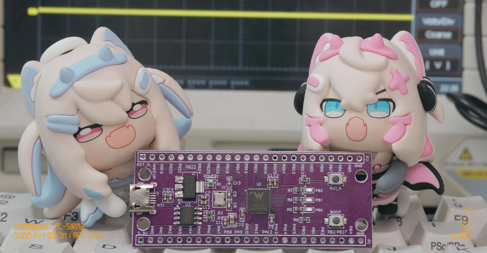

> 🌐 [English Article](/en/posts/csky-rust-embassy/) | [日本語アーティクル](/ja/posts/csky-rust-embassy/)

> 이 글은 공개 C-SKY 아키텍처, 범용 QEMU 환경과 시중에서 구할 수 있는
> HLK-W806-KIT의 검증 내용만 다룬다.

Espressif의 ESP32 시리즈는 Xtensa LX와 RISC-V를, GigaDevice의 GD32
시리즈는 Arm Cortex-M과 RISC-V를 사용한다. 이들보다 덜 알려졌지만 중국
내수용 무선·가전 MCU 중에는 C-SKY ISA를 사용하는 제품도 있다.

<style>
img[src$="rust-shigure-ui-ferris.webp"] {
  display: block;
  width: 60%;
  height: auto;
  margin: 1.25rem auto;
}
</style>


<p style="text-align: center;"><em>이런 간단한 제품이라면 8051이나 C-SKY가 들어가지 않을까요?</em></p>

Rust에는 이미 Tier 3 `csky-unknown-linux-gnuabiv2` 타겟이 있고 LLVM에도
C-SKY 코드 생성기가 있다. 그러나 이것은 Linux 프로그램을 만드는 경로다.
스타트업 코드, 벡터 테이블, 인터럽트, 링커 스크립트와 `core`를 포함하는 MCU
bare-metal 환경은 준비되어 있지 않았다.

이 글은 `csky-unknown-none-elfabiv2` 환경을 만들고, GCC 링커 없이
Rust와 LLVM/LLD로 펌웨어를 빌드하고, QEMU의 CK801·CK802·CK803·CK804·CK805
프로파일과 실제
WinnerMicro W806에서 Embassy executor, timer와
`embassy_sync::Channel`을 실행하기까지의 과정을 정리한다.

## 먼저 결과부터

2026년 9월 현재 확인한 범위는 다음과 같다.

- 패치한 Rust/LLVM으로 CK801, CK802, CK803, CK804, CK805용
  bare-metal Rust 바이너리가 생성되는 것을 확인했다.
- 패치한 LLD로 C-SKY little-endian ELF32가 링크되는 것을 확인했다. 최종
  링크에 GCC toolchain의 `ld`가 사용되지 않는 것도 확인했다.
- 범용 C-SKY QEMU에서 reset, 메모리 초기화, IRQ, compiler builtins,
  Embassy wake/timer/queue를 포함한 workload가 실행되는 것을 확인했다.
- CK804에서 queue 8개 포화, 반복 취소, 동시 deadline, IRQ priority,
  64-bit timebase wrap을 확인했다.
- 표준 Embassy Channel의 ping/pong task가 QEMU와 HLK-W806-KIT에서
  동작하는 것을 확인했다.
- W806의 1 ms TIM0 IRQ로 Embassy time driver를 구동했고, CPU가
  busy-spin하지 않고 `wait32`에서 깨어나는 것까지 실제 보드에서 확인했다.

다만 아직 rustc에 upstream된 완성 타겟은 아니다. 공식 rustup의
`rust-lld`에도 이 C-SKY bare-metal 작업은 들어가 있지 않다. 아래 결과는
프로젝트 로컬 compiler와 patch series를 사용한 실험 결과다.

## C-SKY와 CK80x

C-SKY는 32-bit RISC ISA다. 이 작업은 ABIv2의 CK80x MCU 계열을 중심으로
진행했다. CK801/CK802는 작은 MCU용 프로파일이고 CK803, CK804, CK805로
갈수록 명령과 CPU 구성이 달라진다. 하지만 이 번호를 Armv6-M이나
Armv7-M에 일대일로 대응시키면 안 된다. ISA, ABI, exception entry와
interrupt controller의 모델이 서로 다르기 때문이다.

명령어 집합, register와 exception model의 세부 내용은
[`C-SKY Architecture User Guide`](https://github.com/c-sky/csky-doc/blob/master/CSKY%20Architecture%20user_guide.pdf)를
참고했다.

MCU runtime 관점에서는 다음 차이가 특히 중요했다.

- 예외 진입과 복귀에서는 PSR/EPSR/EPC 및 CPU/compiler의 interrupt-frame
  규칙을 따라야 한다. `ipush`/`ipop`은 이 context 처리에 쓰이는 ISA
  명령이다. 공개 W806 SDK의
  [`vectors.S`](https://github.com/IOsetting/wm-sdk-w806/blob/cb56742abb1b3eb4e0472213e43e0d6028dbb5ba/platform/arch/xt804/bsp/vectors.S#L55-L82)는
  trap 진입 시 일반 register와 EPSR/EPC를 저장하고,
  [`tspend_handler`](https://github.com/IOsetting/wm-sdk-w806/blob/cb56742abb1b3eb4e0472213e43e0d6028dbb5ba/platform/component/FreeRTOS/portable/xt804/cpu_task_sw.S#L119-L150)는
  task context에서 EPSR/EPC를 포함한 상태를 저장·복원한다.
- 아키텍처의 기본 exception vector와 SoC가 제공하는 전체 vector 수는
  구분해야 한다. 실제 MCU는 48개나 64개 entry를 가질 수 있다.
- VBR(Vector Base Register)의 위치와 ROM vector를 RAM으로 옮길지는
  chip/runtime 정책이다.
- CPU interrupt enable과 SoC interrupt controller의 enable, pending,
  priority, wake enable은 별개의 상태다.

공개 보드로는 W800 Arduino, W803 Pico, HLK-W800, HLK-W806 등이 있다.
보드별 핀과 flash 배치는 다르지만 모두 별개의 Rust ISA target인 것은 아니다.
여기서는 비교적 구하기 쉬운 HLK-W806-KIT의 W806, 즉 XT804/CK804EF 계열을
실물 검증용으로 선택했다.

## LLVM backend가 있는데 왜 더 필요했을까

“LLVM에 C-SKY backend가 있다”와 “Rust bare-metal 펌웨어를 완성할 수
있다”는 같은 뜻이 아니다. 후자에는 아래 경로가 모두 필요하다.


flowchart TB
    APP["1. 애플리케이션 / runtime<br/><br/>Cortex-M: Embassy + cortex-m + cortex-m-rt<br/>C-SKY: C-SKY 지원 Embassy + csky + csky-rt"]
    TARGET["2. target / 기본 라이브러리<br/><br/>Cortex-M: rustc 내장 target + 배포된 core<br/>C-SKY: custom target JSON + build-std core / compiler_builtins"]
    TOOLS["3. codegen / 링크<br/><br/>Cortex-M: 배포 rustc / LLVM Arm + rust-lld<br/>C-SKY: project-local rustc / patched LLVM + patched ld.lld"]

    APP --> TARGET --> TOOLS


1. **애플리케이션과 runtime**  
   Cortex-M에서는 Embassy가 [`cortex-m`](https://crates.io/crates/cortex-m)과
   [`cortex-m-rt`](https://crates.io/crates/cortex-m-rt) 위에서 동작한다.
   C-SKY에서는 같은 역할을 C-SKY 지원 Embassy와
   [`csky`](https://crates.io/crates/csky)/[`csky-rt`](https://crates.io/crates/csky-rt)가 맡는다.
   특히 runtime은 reset 진입, 메모리 초기화, vector table과 interrupt 진입·복귀를
   아키텍처에 맞게 제공해야 한다.

2. **target과 기본 라이브러리**  
   일반적인 Cortex-M target 정보는 rustc에 내장되어 있고, 해당 target의
   `core`는 rustup으로 배포된다. C-SKY bare-metal target은 아직 공식 배포물이
   아니므로 custom target JSON으로 CPU와 ABI 등의 조건을 전달하고,
   `build-std`로 `core`와 `compiler_builtins`를 소스에서 함께 빌드한다.

   참고:

   - https://github.com/pmnxis/csky-rust-buildroot/blob/main/config/csky-unknown-none-elfabiv2-ck804.json
   - https://github.com/pmnxis/csky-rust-buildroot/blob/main/scripts/build-example.sh#L38-L43
   - https://github.com/pmnxis/csky-rust-buildroot/blob/main/docs/patches.md#role-of-the-installed-rust-components

3. **codegen과 링크**  
   rustc는 Clang으로 Rust를 컴파일하지 않고 LLVM 라이브러리를 code-generation
   backend로 사용한다. Cortex-M은 배포된 rustc의 LLVM Arm backend와
   `rust-lld`를 사용할 수 있다. 현재 C-SKY 구성은 프로젝트 로컬 rustc의
   패치된 LLVM C-SKY backend로 object를 만들고, 패치된 `ld.lld`와 `link.x`로
   이를 bare-metal ELF로 합친다. Clang은 같은 LLVM 생태계의 C/C++ front end일
   뿐 이 Rust 빌드 경로에는 참여하지 않는다.

이 연구에서는 두 LLVM tree를 사용한다.

1. Rust source에 포함된 LLVM은 rustc의 C-SKY codegen을 담당한다.
2. standalone LLVM tree에서는 `ld.lld`, `llvm-readelf`,
   `llvm-objdump` 등을 빌드한다.

custom target JSON은 CPU, ISA feature, endian, pointer width와 atomic
capability를 rustc에 전달한다. rustup이 custom target용 `core`를 제공하지
않으므로 `-Z build-std=core,compiler_builtins`로 함께 빌드한다.
`no_std`는 `std`를 쓰지 않는다는 뜻이지 `core`도 없다는 뜻이 아니다.

### LLVM/LLD에서 보강한 부분

실제 적용 순서와 patch 파일은
[`patches/llvm`](https://github.com/pmnxis/csky-rust-buildroot/tree/main/patches/llvm)에서
확인할 수 있다.

- assembler의 `.ltorg`/`.pool` literal-pool directive
- little-endian ELF32 C-SKY LLD backend와 초기 relocation
- PC-relative IMM16 relocation의 범위와 정렬 검사
- 자연 정렬된 8/16/32-bit atomic load/store codegen

마지막 항목은 Embassy와 직접 연결된다. CK80x에 compare-and-swap이 없다는
사실과 일반 atomic load/store도 못 한다는 것은 다른 문제다. target은
`max-atomic-width = 32`, `atomic-cas = false`로 능력을 표현하고 LLVM은
가능한 atomic load/store를 생성한다. 그 결과 Embassy에 C-SKY 전용 queue를
넣지 않고 표준 `embassy_sync::Channel`을 사용할 수 있었다.

LLD의 dynamic linking, TLS/GOT/PLT, ELF attributes 병합, 호환 CPU의
`e_flags` 병합, long-branch thunk와 big-endian 회귀는 아직
완성 범위가 아니다. 먼저 MCU의 static bare-metal ELF를 검증했다.

## [`csky`](https://crates.io/crates/csky)와 [`csky-rt`](https://crates.io/crates/csky-rt)

Arm 생태계의 [`cortex-m`](https://crates.io/crates/cortex-m)과
[`cortex-m-rt`](https://crates.io/crates/cortex-m-rt)처럼 두 계층으로 나눴다.

[`csky`](https://crates.io/crates/csky) crate는 CPU 자체의 기능을 제공한다.

- PSR, VBR, SP, EPSR, EPC, CPUID 등 architectural register API
- interrupt mask와 critical-section backend
- compiler barrier와 hardware barrier
- `nop`, `wait` 등의 저수준 명령

[`csky-rt`](https://crates.io/crates/csky-rt)는 프로그램이 main에 도달하기 전과
interrupt entry를 담당한다.

- reset handler, stack, `.data` 복사와 `.bss` 초기화
- `#[csky_rt::entry]` Rust entry macro
- 32/48/64-entry vector layout과 default handler
- flash vector를 RAM으로 옮기는 VBR 정책
- Rust IRQ handler로 전환하는 assembly wrapper

W806의 clock, GPIO, UART, TIM, VIC register는 SoC HAL/BSP의 책임이다.
범용 runtime은 vector 크기와 VBR 정책을 선택하게 하지만 특정 제품의
memory map을 내장하지 않는다.

### IRQ frame은 CPU feature에 따라 달라진다

C-SKY의 `ipush`만으로는 Rust 호출에 필요한 모든 register가 보존되지 않는다.
wrapper가 r15를 추가로 저장하고, high-register가 있는 CK804E/EF에서는
r18–r31도 보존한다. 반대로 해당 register가 없는 CPU에 같은 frame을 무조건
쓰면 안 된다. 따라서 nested IRQ frame은 CPU profile별로 구분해서 검증해야
한다.

※ *W806은 CK804EF지만 현재 target은 LLVM FPU instruction feature를 끈다.*

## Embassy executor와 idle

Embassy는 `async`/`await`를 MCU에서 사용할 수 있게 하는 Rust embedded
생태계다. timer와 protocol state machine을 여러 task로 나누고 await 경계를
명확하게 표현하려는 목적에 잘 맞았다.

주요 변경은 `embassy-executor`의 architecture-specific 부분에만 두었다.
`embassy-time`, `embassy-time-driver`, `embassy-time-queue-utils`,
`embassy-sync`는 가능한 그대로 사용했다. Channel 문제도 Embassy에 임시
구현을 넣지 않고 LLVM atomic 지원을 고쳐 해결했다.

idle 동작은 의외로 깊은 문제였다. 먼저 spin loop로 정확성을 확인한 뒤
`csky::asm::wait()`를 적용했다. interrupt를 막은 critical section 안에서
`wait32`를 실행하면 깨어날 수 없고, interrupt enable 직후 sleep하는
경계에는 check-then-sleep race도 있다.

현재 구현은 다음 순서를 사용한다.

1. interrupt를 막고 executor의 work flag를 다시 확인한다.
2. work가 없으면 인접한 `psrset ie` → `wait32`로 대기한다.
3. W806은 1 ms recurring IRQ를 사용하므로 짧은 경계 race에 걸려도 다음
   tick에 전진한다.


flowchart LR
    CHECK["1. interrupt 차단<br/>work flag 재확인"] --> WORK{"work 있음?"}
    WORK -- "있음" --> RUN["executor 실행"]
    WORK -- "없음" --> WAIT["2. psrset ie → wait32<br/>interrupt enable 후 대기"]
    WAIT --> IRQ["3. 이번 또는 다음 1 ms IRQ<br/>경계 race 뒤에도 wake"]
    IRQ --> RUN


## QEMU를 먼저 사용한 이유

QEMU 변경의 적용 순서와 각 patch의 역할은
[`patches/qemu`](https://github.com/pmnxis/csky-rust-buildroot/tree/main/patches/qemu)에
정리되어 있다.

실물만으로는 interrupt frame, compiler codegen과 peripheral 설정의 문제를
분리하기 어렵다. QEMU에서는 작은 ELF를 만들어 register, exception과 memory
상태를 반복 검증할 수 있다.

초기 C-SKY QEMU 6.x를 검토한 뒤 XUANTIE QEMU 9 branch로 옮겼고,
interrupt controller의 pending mask, priority, IRQ lifecycle과 EPSR 보존을
보강했다.

공개 buildroot의 QEMU는 특정 시판 MCU를 복제한 board model이 아니다.
범용 CPU, interrupt, timer, UART와 semihosting으로 compiler/runtime/executor를
검증한다. 특정 제품의 peripheral, ROM이나 application protocol은 포함하지
않는다. QEMU 통과가 특정 실물의 clock·IRQ·peripheral 호환성을 자동으로
증명하지도 않는다.

### 검증한 항목

- reset, stack, `.data`, `.bss`, vector base
- critical section, 반복 IRQ와 callee-saved register canary
- 256회 IRQ stress와 `compiler_builtins`
- Embassy task wake, timer ordering, cancel/re-arm
- queue capacity 8 포화 뒤 9번째 task의 완료
- 같은 deadline의 alarm과 서로 다른 interrupt priority
- counter wrap 직전·직후 deadline과 64-bit Embassy `Instant`

CK801, CK802, CK803, CK804, CK805의 5개 프로파일에서 workload matrix를
실행했다.

CK802의 E2 명령을 사용하는 64-bit division/remainder에서 LLVM code와 QEMU
결과가 어긋나는 문제는 남아 있다. 임시 `-e2,+e1` 우회 결과를 CK802 E2 지원
완료로 간주하지 않는다.

※ *E1과 E2는 C-SKY ABIv2 toolchain에서 기본 ISA 위에 추가되는 확장 명령군을
구분하는 이름이다. E1은 CK801에 대응하는 첫 확장 명령군이고, E2는 CK802에
대응하는 다음 확장 명령군이다. LLVM에서는 E2가 E1을 포함한다.
***-e2,+e1***은 CK802 CPU 선택은 유지하면서 E2 전용 명령 생성을 끄고 E1
명령까지만 사용하게 하는 LLVM target-feature override다. CPU를 CK801로
바꾸거나 ELF ABI v2를 v1로 바꾸는 옵션은 아니다.*

## HLK-W806-KIT 실물 bring-up



_이 글의 실제 하드웨어 검증에 사용한 WinnerMicro W806 기반 HLK-W806-KIT._

W806의 핵심 구성은 다음과 같다.

```text
CPU              XT804 / CK804EF family
application      0x0801_0400
vector RAM/VBR   0x2000_0000, 64 entries
UART0            115200 baud
Embassy tick     APB TIM0, IRQ 30, 1 ms recurring
idle             C-SKY wait32
```

처음에는 timer가 돌지 않아 CORET, VIC, priority와 PSR을 하나씩 확인했다.
busy-spin에서 TIM0 IRQ와 ping/pong이 동작함을 먼저 증명한 뒤 `wait32`를
적용하자 다시 첫 대기에서 멈췄다.

원인은 W806 VIC의 interrupt enable과 wake enable이 별도 register라는
점이었다. IRQ30을 ISER에만 켜면 CPU 실행 중에는 IRQ가 오지만 `wait32`의
CPU를 깨우지 못했다. VIC `IWER0`(`0xe000_e140`)에 IRQ30 bit
`0x4000_0000`를 설정한 뒤 매 tick에 깨어나 executor를 poll했다.

실물에서 확인한 출력은 다음과 같다.

```text
HLK-W806 Embassy multi-task started
ping: received=0, sent=1, elapsed_ms=250
pong: received=1, sent=2, elapsed_ms=1000
ping: received=2, sent=3, elapsed_ms=250
pong: received=3, sent=4, elapsed_ms=1000
```

이 예제는 `DummyCounter { value: i32, time: Instant }`를 표준 Embassy
Channel로 주고받는다. ping은 250 ms, pong은 1,000 ms를 await한다. 따라서
이 출력은 아래 계층이 함께 작동했다는 근거다.

```text
TIM0 hardware IRQ
  → csky-rt interrupt entry/frame
  → Embassy time driver and timer queue
  → C-SKY executor
  → embassy_sync::Channel
  → ping/pong futures
```

## 재현 가능한 `csky-rust-buildroot`

이 작업을 `csky-rust-buildroot`로 묶었다. Linux Buildroot 자체가 아니라
Cargo `xtask`로 compiler, emulator와 examples를 재현하는 source
buildroot이자 example workspace다.

```sh
# 배포판별 dependency를 설치한다.
cargo xtask deps

# pin한 Rust/LLVM, standalone LLVM, QEMU, Embassy를 받고 patch한다.
cargo xtask fetch

# 로컬 rustc, LLVM/LLD 도구와 QEMU를 빌드한다.
cargo xtask tools

# 기본 timer 예제를 QEMU에서 실행한다.
cargo xtask run

# 표준 Embassy Channel multi-task 예제를 실행한다.
EXAMPLE=embassy-multi-task RUN_SECONDS=15 cargo xtask run

# QEMU transport의 defmt frame을 실시간 decode한다.
DEFMT_LOG=trace RUN_SECONDS=15 cargo xtask run-defmt

# HLK-W806-KIT에 flash하고 UART log를 본다.
./scripts/run-w806.sh multi-task ttyUSB0 --manual-reset
```

`cargo run --example`보다 긴 이유는 package 하나만 빌드하는 일이 아니기
때문이다. project-local rustc, custom target, `build-std`, patched LLD,
image generation과 QEMU 또는 flashing을 같은 조합으로 선택해야 한다.
host Cargo는 orchestrator지만 실제 codegen은 `.local/rust/bin/rustc`,
링크는 `.local/bin/ld.lld`가 담당한다.

이 작업은 Linux host에서만 개발했다. Windows와 macOS에서는 별도로
테스트하지 않았다.

## 아직 남은 일

- CK801/CK802 등의 CPU profile 선택과 E1/E2 feature override 조합이 실제
  지원 명령 범위에 미치는 영향 확인 (현재 정보 부족)
- one-shot IRQ에도 적용 가능한 atomic idle/wakeup 규칙
- FPU를 켠 CK804EF의 IRQ context save/restore
- LLD relocation, attributes, thunk와 endian 확장
- rustc/LLVM/LLD upstream과 rustup 배포 경로
- W806 이외 공개 C-SKY MCU의 clock, flash, IRQ와 peripheral 검증

QEMU와 W806의 성공을 모든 C-SKY MCU의 성공으로 일반화해서는 안 된다.
CPU feature, vector count, interrupt controller, wake register, ROM contract와
memory map은 SoC마다 다를 수 있다.

## 마치며

출발점은 “LLVM에 C-SKY backend가 있으니 target JSON 하나면 되지 않을까”였다.
실제로는 codegen, linker, runtime, vector/IRQ ABI, atomics, executor,
emulator와 SoC wake mechanism 각각에 대한 이해가 필요했고, 이를 하나의
연속된 경로로 연결하기 위해 많은 작업이 들어갔다.

이제 GCC 링커 없이 Rust와 LLVM/LLD로 C-SKY bare-metal ELF를 만들고,
QEMU의 여러 CPU profile을 회귀 검사하며, 실제 W806에서 `wait32` 기반
Embassy executor, hardware timer와 표준 Channel을 실행할 수 있다.

이 기반을 통해 C-SKY 바이너리를 테스트하고 분석할 수 있으며, QEMU 가상
환경에 전용 scratch register를 구성해 외부 상태와 입력을 주입함으로써
펌웨어 코드의 동작과 기능을 에뮬레이션에서 검증할 수도 있다. 향후 CI/CD
회귀 시험과 C-SKY 펌웨어 연구에도 활용할 수 있을 것으로 기대한다. 더 많은
시판 C-SKY MCU에서 이를 검증하는 것이 다음 목표다.

## 관련 자료

- C-SKY Rust buildroot and examples: <https://github.com/pmnxis/csky-rust-buildroot>
- LLVM/LLD patch series: <https://github.com/pmnxis/csky-rust-buildroot/tree/main/patches/llvm>
- QEMU patch series: <https://github.com/pmnxis/csky-rust-buildroot/tree/main/patches/qemu>
- Embassy fork integration notes: <https://github.com/pmnxis/csky-rust-buildroot/tree/main/patches/embassy>
- [`csky` architecture crate](https://crates.io/crates/csky): [source](https://github.com/pmnxis/csky)
- [`csky-rt` runtime crate](https://crates.io/crates/csky-rt): [source](https://github.com/pmnxis/csky-rt)
- Experimental C-SKY Embassy branch: <https://github.com/pmnxis/embassy/tree/feature/csky-experimental>
- C-SKY architecture documentation: <https://github.com/c-sky/csky-doc>
- XUANTIE QEMU: <https://github.com/XUANTIE-RV/qemu>
- Embassy: <https://github.com/embassy-rs/embassy>
- WinnerMicro W800 documentation: <https://doc.winnermicro.net/w800/en/latest/>
