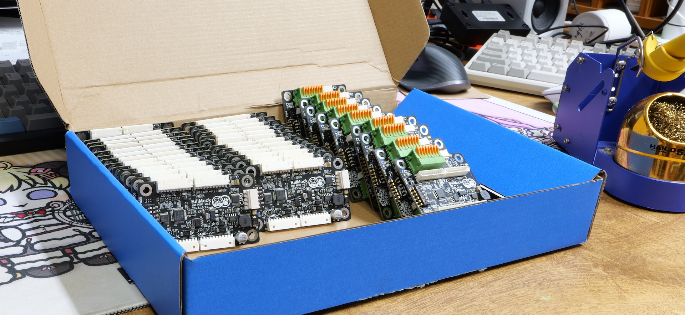
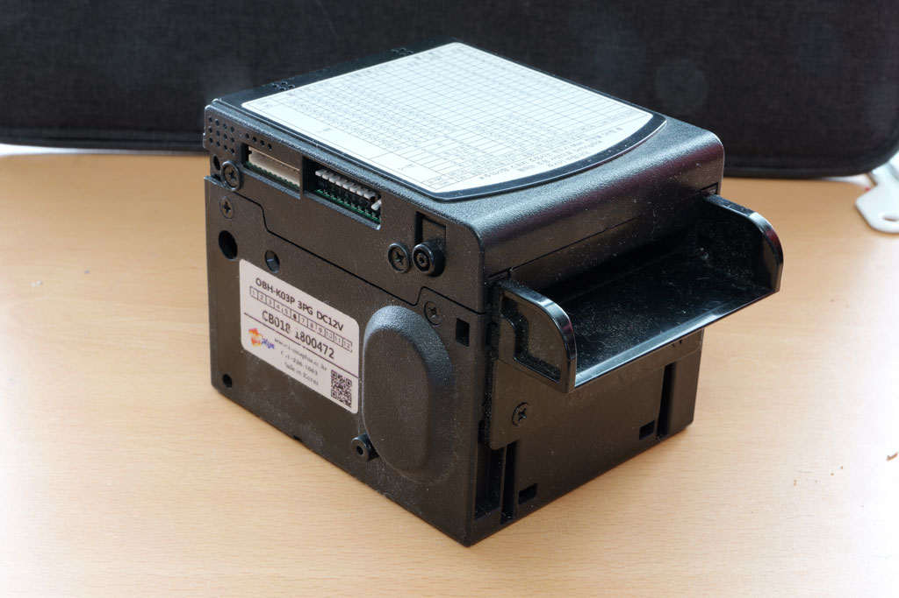
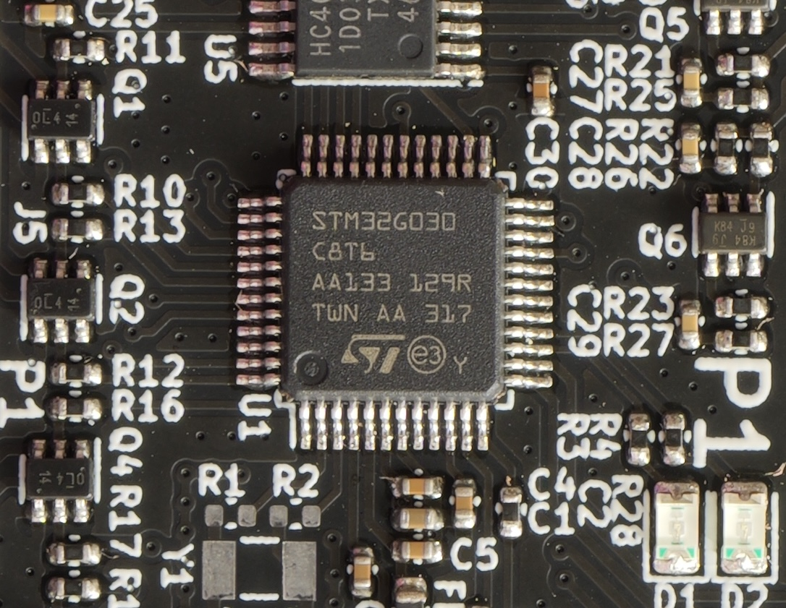
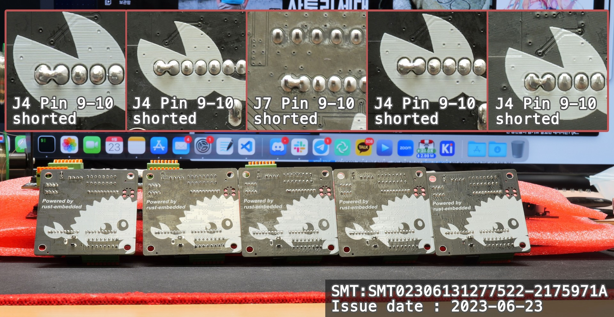
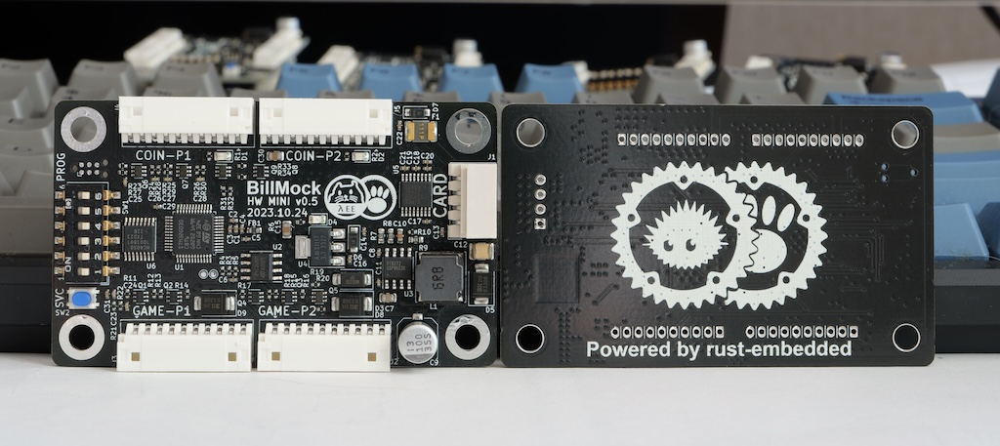

> This article is still being written. Content may change along the way.

_A test unit recently sent out to the field_

## Introduction
As a language to replace C, Rust is a language that has been receiving a lot of attention. While I am currently doing backend development, from the perspective of someone who used to live and breathe firmware, I have always held the belief -- past and present -- that if a programming language is not an HDL language, "it must be able to run on a 500-won MCU."

From this perspective, aside from zig which is currently gaining traction, I believe **Rust** is the only language that can replace C. However, this claim had the flaw that "I had never developed firmware at a production level with Rust." Being aware of this shortcoming, after several attempts over 2-3 years, a commercial Rust embedded project that I finally started in July 2023 has reached the initial mass production phase.

I intend to cover my experience with Rust embedded, its advantages, and various techniques across multiple articles. In this article, I would like to introduce the development framework used, what was developed for the project, and briefly share my impressions.

As a personal ambition, I would like to write a book about **Rust embedded** based on this experience, but I have not been able to decide on the target audience from among three categories. Until I settle on a target audience in my mind, I expect to organize things in a free-form manner as they come to me.
1. "Developers who already have experience with Rust"
2. "Developers whose primary job is not embedded but who do Arduino as a hobby"
3. "Existing embedded developers"

The reason I bother to explain this is that there are so few embedded developers using Rust. Most readers will likely fall into the category of developers interested in Rust, and trying to explain both the unfamiliar **Rust** and **embedded** simultaneously would be far too unkind. So even if the writing progresses slowly, I intend to go through the process of providing some perspective on the development process of **embedded**.

## Product Planning

To the question of why card payment terminals are only being installed in arcades now in 2023, you need to look at the history of the arcade industry itself. Due to the "Sea Story" gambling scandal around 2007, it was not possible to install card terminals until 2020. From 2020 onward it became possible, but in that case, the game itself had to go through the approval process again. However, related regulations have recently been relaxed, and a request came in for me to develop a module that enables card terminal installation.

- [Game Rating and Administration Committee decides to diversify arcade game payment methods starting next month - 2019-06-28](https://www.grac.or.kr/Board/NewsData.aspx?bno=351&type=view)
- [Regarding changes to payment methods for all-ages arcade games - 2022-03-21](https://www.grac.or.kr/board/Inform.aspx?bno=746&type=view)

_Example of a bill acceptor_

Card terminals use RS232 serial communication, and existing arcade machines use a Molex 2.00mm pitch 10-pin connector for the bill acceptor, or 2-4 pin connectors for the coin acceptor.
Unless special features are used, the signal systems of the 10-pin bill acceptor and coin acceptor are compatible. Given that prices have risen significantly compared to the past, 1000-won bills are used much more frequently than 500-won or 100-won coins as a payment method, so I decided to prioritize the bill acceptor wiring.

To add a card terminal to an existing arcade machine, the only option is to share the existing currency payment signal lines and generate signals in place of the bill acceptor (or coin acceptor). However, if you simply inject signals onto the existing wiring, the signals from the bill acceptor and the card terminal would overlap. Therefore, a FIFO Queue was applied to each signal output so that bill acceptor and card terminal inputs can be processed sequentially even if they overlap, and the hardware was designed accordingly.

## Hardware Development
### `STM32G030C8Tx` Chip Selection

[`STM32G030C8Tx`](https://www.st.com/en/microcontrollers-microprocessors/stm32g030c8.html) is a Cortex-M0 (ARM Cortex-Mv6) MCU from ST. An MCU is a device that contains a 32-bit CPU along with peripherals for embedded use. This product has 64 KBytes of Flash for storing programs and 8KB of SRAM (similar to a computer's RAM), and operates at 16 MHz. There is also a variant with half the capacity at 32 KBytes, but based on the experience at my company that 32 KBytes was not enough for a Rust debug build for even simple products, and the expectation that the features and business logic would likely grow, I chose 64 KBytes without going much higher. Additionally, this was based on the belief that being able to create a Rust embedded product on an inexpensive MCU with minimal computing resources would prove that Rust can be used for production and professional embedded development. (I have heard that you can write embedded code in Go, Python, and JavaScript too, but I think it is very difficult to use them in production environments where the cost must be very low, and it is meaningless if it only runs on expensive chips.)

### PCB (Circuit) Development

The Gerber data on the left is not publicly released, but the schematic (circuit diagram) is. [BillMock-HW-RELEASE](https://github.com/pmnxis/BillMock-HW-RELEASE)

KiCad was used for circuit development. KiCad is an open-source EDA CAD program released by CERN. It supports all commonly used operating systems -- Linux, macOS, and Windows. I have been using it since version 5.x, and after going through 6.x, it became quite usable at 7.x, so I applied it to this project as well.

PCB (circuit) development roughly divides into schematic development and Gerber artwork.
A schematic is a diagram that represents how the circuit is to be configured, as shown in the right image.
Gerber artwork, as shown in the left image, represents how the copper traces and components will actually be printed/mounted.
Depending on the required connector positions in the circuit, the speed of communication on the traces, the magnitude of electrical signals, and power requirements, components are placed closer or farther apart, and traces are routed thicker or relatively thinner.

Just as programs need optimization, circuits also need optimization. It is important to reduce the number and variety of components, use reasonably priced parts, reduce overall size or lower specifications to cut costs, while maintaining the hardware's functionality and stability as planned.

### Prototype Production
JLCPCB was used for prototyping. For a company project, the orthodox choice would be to use a domestic turnkey manufacturer. However, having already used JLCPCB's SMT (assembly) service several times, I did not need any additional adaptation, and I had confidence that if JLCPCB could produce good results at very low cost for small quantities, it would work fine at another manufacturer for mass production later. (JLCPCB is exceptionally inexpensive for small sample runs.)

To draw an analogy for backend server developers, I think it is similar to the thought: "If it runs on a 10-year-old school club server, it will probably run fine in the IDC for the final release."

### Final Mass Production
#### BOM Organization and Parts Procurement

Unlike software, as you get closer to hardware, you frequently hear the term BOM. Bill of Materials is literally a parts list and inevitably includes pricing and various other information. If the price is too high, you go back to the design stage and either make major design changes or, if there are components that can be replaced without design changes, substitute them with alternatives. During this process, I determined that costs were too high, reduced the number of connectors, and based on some demand forecasting, decided to purchase components in advance in "Reel" units.

_Components sent to the assembly factory for mass production. A Reel refers to a cylindrical spool where components are wound up like film tape._

BOM organization and optimization are very important, but since it is a topic that generally does not excite typical software developers, I think watching YouTuber Seungwoo Daddy's restaurant BOM video can make it interesting. While it is about BOM (ingredient) management in restaurant operations rather than electronics, I think it is very informative.

[`Let me tell you why this happens.` - Seungwoo Daddy Daily Channel](https://www.youtube.com/watch?v=E8v79tPT3GI)

#### Production Outsourcing / Assembly Outsourcing
Manufacturing a PCB and soldering components onto it (assembly, PCB Assembly) are separate tasks.
There are cases where a turnkey company handles parts procurement as well, but in my case, I proceeded with company-supplied materials (purchasing and providing the parts ourselves).

I used a turnkey company recommended by a senior colleague at the company who had previous mass production experience. (Trust-based, saving the time of searching around.)

#### Reasons for Domestic Mass Production (Why Not JLCPCB or Other Chinese Manufacturers)
Before present-day China emerged, Korea was capable of quickly handling everything from PCB manufacturing and assembly (+development) to product case injection molding and sheet metal fabrication for the entire world, and that supply chain still remains. Korea is still a country that can handle most processes of electronic product manufacturing and production. However, due to low prices and marketing, the practice of outsourcing sampling and small-scale production to Chinese companies has spread widely through YouTube and online communities. In Korea, if you can find the routes (manufacturers) known only to practitioners, and if those manufacturers accept the work, it is advantageous to conduct mass production domestically up to a certain quantity. If you are producing hundreds of thousands of units per month, it may be more cost-effective to outsource to overseas manufacturers, but for small quantities of several thousand or tens of thousands, you lack the ability and personnel to inspect whether the overseas factory performs well each time, and there is no way to hold them accountable if something goes wrong.

Based on the PCB I made, assuming a production run of 1,000 units, JLCPCB is overwhelmingly cheaper, but there exists a point where the difference is only about 20-30%. When you factor in shipping costs, customs duties, and other administrative expenses, JLCPCB did not really provide much of an advantage. More importantly, the issue is that they do not properly take responsibility when problems occur. Besides JLCPCB, other overseas manufacturers may offer good quality, but the problem of not being able to visit in person to discuss issues when they arise still remains.

_In the early days, I ordered 10 PCBs and 5 were defective, but I had to file the claim first._

#### Program Download

[MP Tool](https://github.com/pmnxis/billmock-mptool)

Even after the PCB is manufactured, it does not just work -- you need to load the program onto it. There are cases where the assembly contractor can load the program binary upon request, but this time a custom program was needed, so I decided to handle the flashing directly.

Covering why that process was necessary and how it was developed would make this too long, so I will address it in a separate article.

The rough process is as follows:


graph LR;
    A[Power Up] -->|Flash \nLock Check| B(Unlock Flash\nTemporary)
    B --> C[Program\nDownload]
    C --> |OTP section\n check|D{S/N Exist?}
    D -->|Yes| E[Update to DB]
    D -->|No| F[Write New OTP\n& Insert to DB]


Here, an additional step is included to check the serial number in the OTP section and either add or update the information accordingly.
If there is no serial number in the OTP, a serial number is written to the OTP section.

## Closing Remarks

_The final mass-produced board_

Next time, I plan to cover the firmware software development side of things developed in Rust, and after that, I expect to cover the Rust embedded ecosystem and techniques I have picked up.

I am very happy that my first personal mass production experience was built on firmware developed in Rust and that it was completed successfully.

If asked to do personal mass production again, I do not think I could. I will treasure it as a valuable experience that helps with development, but handling everything alone as a primary job is too much. Still, I recommend trying it at least once if you get the opportunity to do a production run on your own.

-------------------------------

Check out other articles in this series:
[Rust Embedded Mass Production Development Story](/categories/my-frist-mass-production-with-rust-embedded/)

