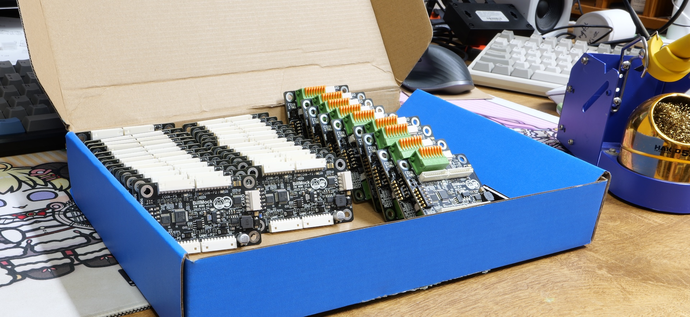
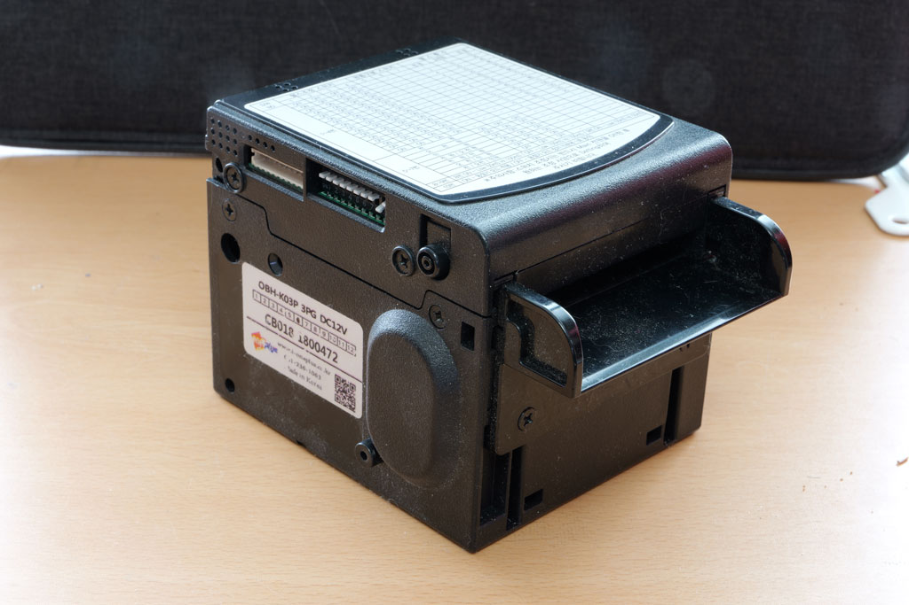
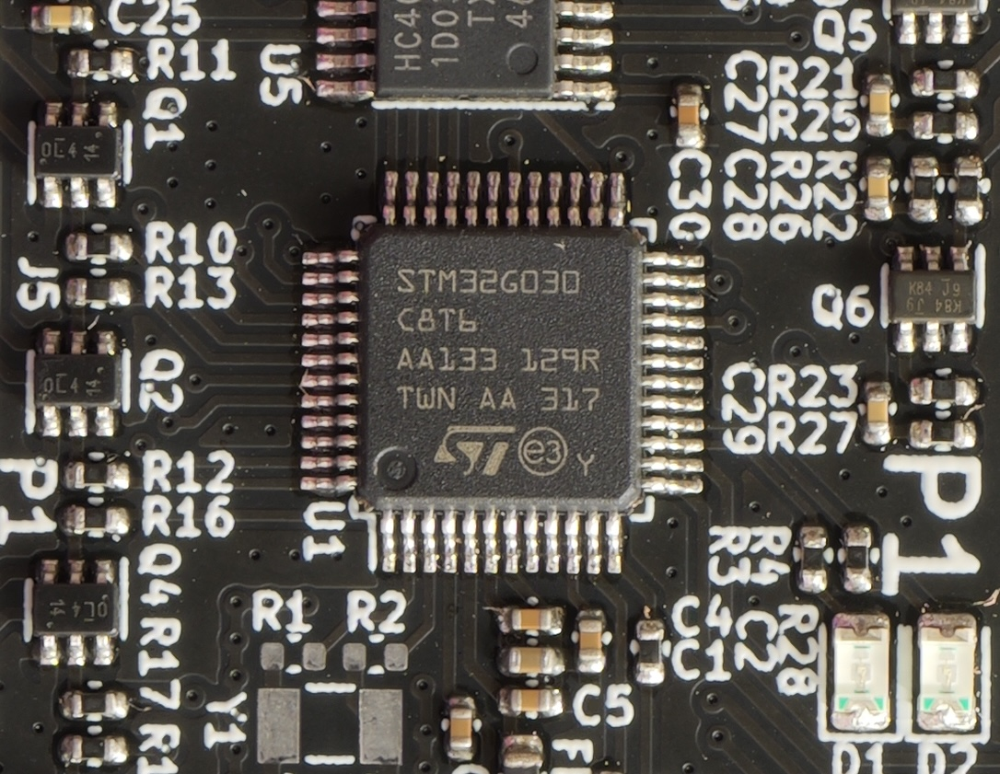
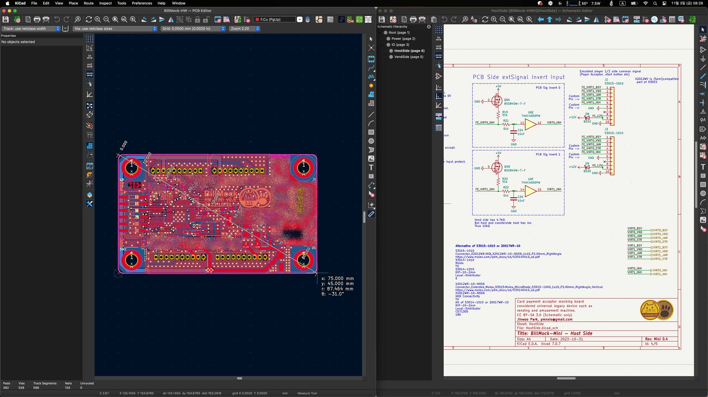
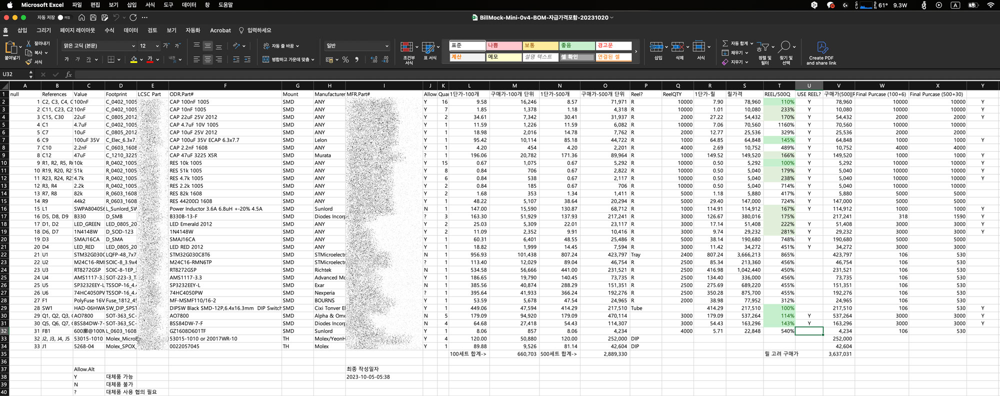
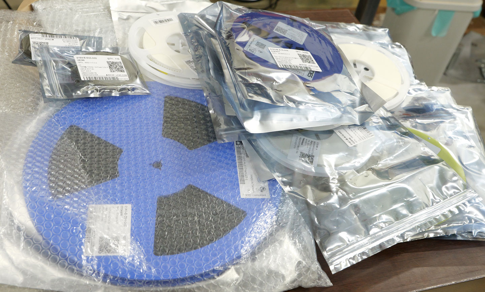
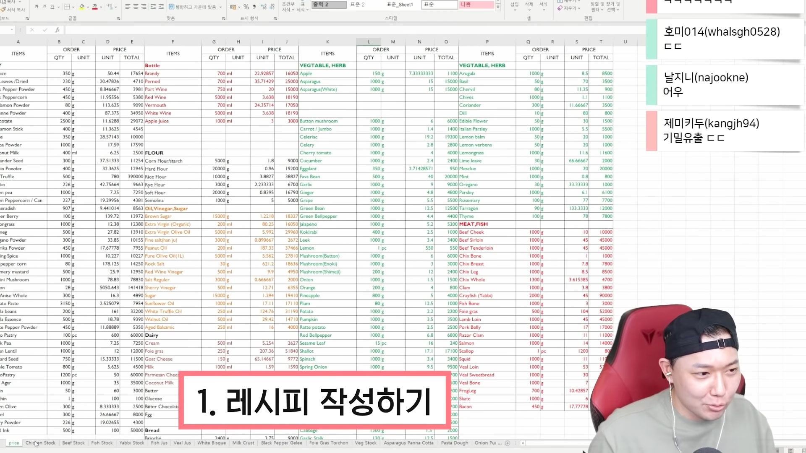
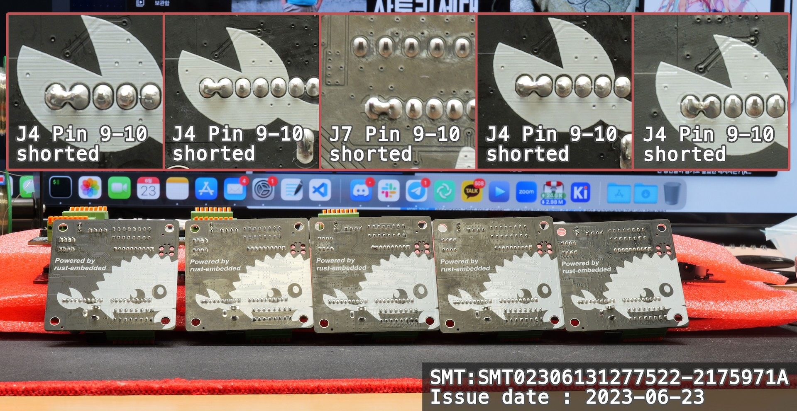

> 아직 작성 중인 글입니다. 중도에 내용이 변경 될 수 있습니다.

_최근에 현장에 내보낸 테스트용 기기_

## 서론
C를 대체할 언어로서, 러스트는 주목을 받는 언어이며, 현재는 백엔드 개발을 하고있지만 과거 펌웨어에 빠져살던 나의 기준으로서, 예나 지금이나 프로그래밍 언어는 HDL언어가 아니라면 "500원 짜리 MCU에서 돌아가야한다" 라는 생각을 갖고있다.

이런 관점에서는 현재 뜨고 있는 zig 외에는 **러스트**만이 C를 대체할 언어라고 생각한다. 하지만 이 주장에는 `내가 러스트로 펌웨어를 양산레벨로 개발해본적이 없다` 라는 결점이 존재한다. 이러한 문제점을 인지하고 몇번이나 시도를 2-3년 정도 하다가, 드디어 2023년 7월 부터 시작한 상용 러스트 임베디드 프로젝트가 제품 초기 양산 페이즈를 밟게되었다. 

내가 경험한 러스트 임베디드 그리고 장점과 기법등을 여러 글에 나눠서 다루고자 한다. 이 글에서는 사용한 개발 프레임워크, 프로젝트를 위해 개발 한 것들, 간단히 느낀 것에 대해 소개하고자 한다.

개인적인 욕심으로 이번 경험을 통해 **러스트 임베디드** 에 관한 책을 싶으나 독자층을 3가지 분류에서 정하지를 못해, 책을 위해 독자층을 마음속에서 정하기전까지는 생각 나는대로 정리하는 형태로 예상하고 있다.
1. "이미 러스트를 경험한 개발자"
2. "취미로 아두이노를 하는 임베디드가 주업무가 아닌 개발자"
3. "이미 임베디드 개발자"

번거럽게 이걸 설명하는 이유는, 러스트를 쓰는 임베디드 개발자가 너무 적기 때문에 대다수는 러스트에 관심이 있는 개발자의 범주에서 당장은 쓸 것이며 미지의 **러스트** 와 **임베디드** 둘 다 동시에 설명하기에는 너무나도 불친절하기 때문에 글의 서술이 느리더라도 **임베디드** 의 개발과정의 면을 조금 바라볼 수 있도록 서술 하는 과정을 걸치려고한다.

## 제품 기획

2023년이 되서야 카드단말기를 달게 됬는가 라는 질문에는 오락실 산업 자체의 역사를 봐야한다. 2007년 경 바다이야기 이슈로 2020년까지 카드단말기와 같은 것을 달수 없다가 2020년부터 달 수 있게됬으나 이 경우에는 카드단말기를 다는 경우 게임 자체의 심의를 다시 받아야만 했다 하지만 이에 관해서 법이 최근에 와 허들이 낮아지게 되었고 최근에 와 나에게 카드단말기를 달수 있게 해주는 모듈의 개발 의뢰가 들어왔다.

- [게임위, 내달 1일부터 아케이드 게임 결제 방식 다양화하기로 결정 - 2019-06-28](https://www.grac.or.kr/Board/NewsData.aspx?bno=351&type=view)
- [전체이용가 아케이드 게임물 결제방식 변경 관련 - 2022-03-21](https://www.grac.or.kr/board/Inform.aspx?bno=746&type=view)

_지폐입력기의 예시_

카드 단말기는 RS232 시리얼 통신을 사용하고 있으며, 기존 게임기는 molex 2.00mm 간격의 10핀 커넥터를 지폐입력기 용으로 사용하며 혹은 2~4핀의 커넥터를 동전입력기 용으로 사용한다.
특수한 기능을 쓰지않으면 10핀을 쓰는 지폐입력기와 동전입력기의 신호체계는 호환이 되며 과거와 달리 물가가 많이 오른 시점에서 500원, 100원 주화보다는 1000원 지폐를 지불방식으로 많이 사용하고 있기에 지폐입력기의 배선을 좀 더 우선하기로 했다. 

기존 게임기에 카드단말기를 추가하기 위해서는 기존 화폐 지불 신호선을 공유하여 사용하여 지폐입력기 (혹은 동전입력기) 대신 신호를 만들어 주는 수 밖에 없다. 이 때 단순히 기존 배선에 그대로 신호를 주게되면 지폐입력기의 신호와 카드단말기에서 나온 신호가 중첩되게 된다. 따라서 각 신호의 출력쪽에 대해 FIFO Queue를 적용하여 지폐입력과 카드단말기 입력이 중첩되도 순차처리 할 수 있도록 구성하고 하드웨어도 이를 고려하여 구성하였다.

## 하드웨어 개발
### `STM32G030C8Tx` 칩선정

[`STM32G030C8Tx`](https://www.st.com/en/microcontrollers-microprocessors/stm32g030c8.html) 은 ST 사의 Cortex-M0 (ARM cortex-Mv6) MCU이다. MCU는 32비트 CPU를 내장하고 임베디드를 위한 주변장치를 탑재하는 물건을 말한다. 이 제품은 64KBytes의 프로그램을 담을 수 있는 Flash와 8KB SRAM(컴퓨터의 RAM과 비슷) 이 있으며 16Mhz로 동작한다. 절반의 용량인 32KBytes 을 갖고있는 제품도 있지만 회사에서 간단한 제품을 개발할때 32Kbyte는 rust에서 debug build를 올리기엔 무리가 있었다라는 경험과 비교적 기능이나 비즈니스 로직이 커질 것 같다라는 예상이 있어 확 늘리진 않고 64Kbyte로 정했다. 그리고 전반적으로 최소한의 컴퓨팅 리소스를 갖고있는 저렴한 MCU에서 러스트 임베디드 제품을 만들수 있어야 러스트로 임베디드를 양산, 업무용으로 쓸수 있다라는것을 증명 할 수 있다 라는 생각도 기반했다. (Go, Python, Javascript로도 임베디드에 돌아가는 코드를 만들수는 있다고한다 하지만 양산용으로 쓸수있는 단가가 매우 낮은 환경에선 많이 힘들다고 생각하고 비싼 칩에서만 돌아가면 의미 없다고 생각한다.)

### PCB (회로) 개발

왼쪽의 Gerber 데이터는 공개를 하지않지만 schematic (회로도) 는 공개를 하고있다. [BillMock-HW-RELEASE](https://github.com/pmnxis/BillMock-HW-RELEASE)

회로 개발에는 KiCad 를 사용하였다. KiCad 는 CERN이 공개한 오픈소스 EDA 캐드 프로그램이다. 보편적으로 사용하는 OS, Linux, macOS, Windows 를 전부 지원하며 5.x 버젼부터 써왔으며 현재 6.x를 거쳐 7.x에서는 꽤 쓸만하져 이번 프로젝트에도 적용했다.

PCB (회로) 개발은 대략적으로 schematic개발과 gerber artwork으로 나뉜다.
schematic은 오른쪽 이미지와 같이 회로를 어떻게 구성할지에 대한 도식표로 나타낸 형태이다.
gerber artwork은 왼쪽 이미지와 같이, 실제로 어떻게 구리배선과 부품들을 인쇄/실장 할 것인지 나타내는 형태이다.
회로상에서 요구되는 커넥터의 위치, 배선에 흐르는 통신의 속도나 전기적인 신호의 크기, 전원 요구사항 등에 따라 가까이 배치하거나 멀리배치, 그리고 두껍거나 비교적 얇게 배선을 라우팅한다.

프로그램도 최적화를 하듯이 회로도 최적화가 필요하며 적거나 적은 종류의 부품, 적당히 값싼 부품, 전체적인 사이즈 감소나 사양 을 낮추면서 단가를 줄이되 기획상 하드웨어의 기능과 안정성은 어느정도 들고가는 것이 중요하다.

### 프로토 타입 생산
프로토 타입은 JLCPCB를 이용하였다. 회사에서 진행하는 프로젝트라고 한다면 국내 턴키업체에 맞기는게 정석적인 선택이나, 이미 JLCPCB의 SMT(부품 조립)서비스를 여러번 써본 입장에서는 오히려 적응을 따로 할 필요도 없고 JLCPCB에서 소량에 대해 매우 저렴하게 결과물이 잘 나온다면, 나중에 다른 업체에서 양산을 한다고 해도 왠만해서 될거라는 믿음이 있었다. (소량 샘플은 JLCPCB가 이례적으로 저렴하다.)

백엔드 서버 개발자의 입장에서 비유를 한다면, "`10년된 학교 동아리 서버에서 돌아가니, 최종 릴리즈때 IDC에서 잘 돌아가지 않을까`" 라는 생각과 비슷하지 않을까 생각한다.

### 최종 양산
#### BOM정리 및 부품 구매

소프트웨어와 다르게 하드웨어에 가까워지면, BOM이라는 단어를 많이 듣게 된다. Bill Of Matterial 은 말그대로 부품리스트 이며 가격이나 이것저것 정보를 필연적으로 포함하게된다. 여기서 가격이 너무 비싸면 설계단으로 되돌아와 크게 설계를 바꾸거나 설계 변경없이 변경가능한 부품이 있으면 대체 부품으로 채워 넣기도 한다. 이 과정에서 한번 자체적으로 너무 비싸다는 판단을 내려 커넥터 개수를 줄이고 어느정도의 수요 예측을 통해 "Reel" 단위로 부품을 미리 땡겨서 구매하도록 했다.

_양산을 위해 조립 공장에 보낸 부품들, Reel은 원통형으로 부품이 필름테이프 처럼 감겨있는것을 Reel이라고 한다._

BOM 정리 / 최적화는 매우 중요하나 일반적인 소프트웨어 개발자에게는 감흥이 없는 주제이므로 유튜버 승우아빠의 레스토랑 BOM을 보면 재미를 느낄 수 있다고 생각한다. 전자 회로에 대한 이야기가 아닌 레스토랑 운영에서의 BOM(음식재료) 관리이긴 하나 매우 유익하다고 생각한다.

[`왜 이렇게 되는지 알려드리겠습니다.` - 승우아빠 일상채널](https://www.youtube.com/watch?v=E8v79tPT3GI)

#### 생산 위탁 / 조립 위탁
PCB를 만드는것과 부품을 그위에 올려서 납땜하는 것(조립, PCB Assembly)은 별개의 일이다.
턴키 업체에 부품 구매까지 맡기는 경우가 있으나 나의 경우엔 사급(이쪽에서 구매해서 제공함)으로 진행하였다.

그리고 업체는 이미 양산 경험이 있는 회사 선배의 추천을 받은 턴키업체를 이용하였다. (신뢰 기반으로 발품 파는 시간을 줄였다.)

#### 국내에서 양산을 한 이유 (JLCPCB 혹은 다른 중국에서 하지 않은 이유)
국뽕이라고 하면 국뽕이 될 수 있지만 한국은 아직까지 제조업을 어느정도 내부에서 처리할 수 있는 나라이다.
해외에 1인으로 개인 양산하는 외국인들은 중국업체에 주로 맡기나, 한국에선 국내에서 다 처리가 되므로 양산만큼은 국내에서 하면 좋다.
수량이 매달 몇 만개 이상 만든다고하면 해외에 공장을 둠으로서 더욱 생산 단가를 줄일 수 있겠지만 1인 개인 양산에서는 해외 공장이 매번 잘하는지 감시할 능력과 인력, 그리고 잘못되었을때 책임질 수 가 없다.

내가 만든 PCB기준으로 1000대를 양산한다고 가정했을 때, JLCPCB가 압도적으로 저렴하긴 하나, 어느 시점에서는 20~30%정도 밖에 차이가 나지않는 지점이 존재했다. 거기에 운송비, 관부가세, 기타 행정 비용을 고려하면 JLCPCB쪽이 별로 이득을 가져다 주지도 않았고 다른 것 보다 문제가 발생했을때에 대해 책임을 제대로 지지않는 다는 것이다. 이 외에 JLCPCB 말고 다른 해외 업체들은 퀄리티는 좋으나 결국에는 문제가 발생했을때 직접 찾아가서 논의를 하기 힘들다라는 문제점은 여전히 존재한다.

_초창기 PCB 10대를 주문했는데 5대가 불량이였다, 하지만 내가 먼저 클레임을 걸어야한다._

#### 프로그램 다운로드

[MP Tool](https://github.com/pmnxis/billmock-mptool)

PCB를 만들었다고 해도, 그냥 돌아가는게 아니라 프로그램을 넣어줘야한다. 조립 위탁 단계에서 요청하면 프로그램 바이너리를 넣어주는 경우도 있으나 이번에는 커스텀 프로그램이 필요하여 이쪽에서 직접 넣는 방향으로 했다.

왜 그런 과정을 거치고 어떻게 개발했는지에 다루면 너무 길어지기에 차후 다른 글에서 다루도록 하고

대략적인 과정은 이러하다


graph LR;
    A[Power Up] -->|Flash \nLock Check| B(Unlock Flash\nTemporary)
    B --> C[Program\nDownload]
    C --> |OTP section\n check|D{S/N Exist?}
    D -->|Yes| E[Update to DB]
    D -->|No| F[Write New OTP\n& Insert to DB]


여기서 OTP섹션에 있는 시리얼 넘버를 확인하고 유무에 따라 정보를 추가하거나 갱신하는 과정이 추가로 들어간다.
OTP에 시리얼 넘버가 없으면 OTP섹션에 시리얼 넘버를 기입한다.

## 글을 마치며

_최종 양산한 기판_

다음에는 rust로 개발한 펌웨어 소프트웨어 개발 측면에서 다루고 그 뒤에는 러스트 임베디드 생태계, 터득한 테크닉? 같은것을 다루지 않을까 싶다.

처음으로 개인 양산을 경험한 것이 러스트로 개발한 펌웨어 위에서 돌아가는 것 과 성공적으로 양산을 마칠 수 있어서 매우 기쁘게 생각한다.

다음에도 개인에서 양산을 하라고 하면 못할 것 같다. 개발을 하는데 있어서의 도움되는 귀중한 경험으로 삼고 이걸 주업으로 혼자서 다 소화하기에는 큰 무리가 있다. 그래도 한번쯤은 혼자서 양산을 태워볼 기회가 있으면 해보는 것을 추천한다.

-------------------------------

이 시리즈의 다른 글도 같이 봐주세요 : 
[러스트 임베디드 양산 제품 개발기](/categories/my-frist-mass-production-with-rust-embedded/)
