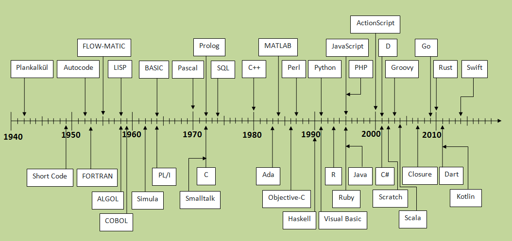
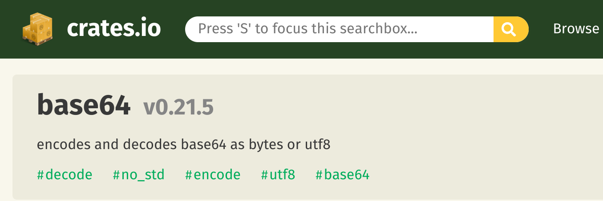


**WARN!** This article is still a work in progress. Content may change at any time.



_RIIR BEAM_

## Introduction
Continuing from the previous post, I want to briefly cover the pros and cons of applying Rust to embedded development, as well as how to study Rust for embedded.

## What I Felt After Using Rust for Embedded

### There is a 38-Year Gap Between C and Rust
 _Image source: [History Of Programming Languages](https://javaconceptoftheday.com/history-of-programming-languages/)_

C was released in 1972, and Rust was released in 2010. There is at least a 38-year gap between them, during which many languages, concepts, and changes emerged.

C has structs, but it is fundamentally a **procedural** and strongly-typed language.
Rust is a strongly-typed language with **object-oriented** capabilities (without inheritance, unlike C++), and like C and C++, it is designed with systems programming in mind.

In my personal interpretation, while C is strongly typed, it is a language tightly bound to CPU registers. In comparison, Rust is less dependent on CPU registers than C, but you can still be register-aware when programming in certain situations. I believe Rust has its strong typing characteristics rooted in the concept of "objects."

C has been maintained for a long time, and if you only work on embedded, you can be very fluent in C. However, there can be many challenges when adapting to a modern language like Rust. The biggest challenge is probably designing "objects" and "methods." If you have only done procedural programming, you may struggle with this for at least several months.

Beyond this, there are many things you need to break out of your existing mental framework -- the philosophy of explicitly distinguishing nullable values, ownership, and more. Understanding these concepts, and occasionally breaking them in low-level control (unsafe), or tuning for program size, is a process where you can gain a lot of CS knowledge and philosophical insight. I believe this is the most valuable part.

### Advantages of Applying Rust to Embedded (Firmware) Projects
- Thanks to built-in test support in the language spec, writing partial unit tests is straightforward.
- If the logic itself is sound and unit tests back it up, integration testing can be kept to a minimum while still catching bugs.
- Code written for firmware could be reused to a certain extent on backend servers.
- clippy and the formatter are built-in, making it easy to eliminate unnecessary code and unify code conventions.
- Object-oriented design (without inheritance) makes code reuse practical.
- The Cargo ecosystem makes adding libraries really convenient. Toolchain setup is also very simple.
- You can use `async / await` in firmware instead of `epoll`.
- Procedural macros are available.
- It is safer than writing in C, and you can significantly reduce mistakes during the development process.

### Disadvantages of Applying Rust to Embedded (Firmware) Projects
- There are still not many reference projects to look at.
- It is practically difficult to apply to 8-bit processors.
- When putting data into queues or arrays, you tend to define separate, smaller types for enums, options, and structs to minimize size. Implementing Into/From for these is a bit tedious.
- You need to consider nightly features to some extent.
- When viewing compiled binaries with Ghidra/objdump, the output differs quite a bit from conventional C code. (Static analysis at the assembly level is still difficult. This is more of a characteristic than a disadvantage.)
- If you lack experience with object-oriented programming, you may end up writing procedural-style Rust code.

### With All These Disadvantages, Should You Still Use It?
Ultimately, it comes down to individual or organizational choice, but I personally think you should.

The reason is that I believe you cannot keep insisting on C forever. No matter how unique manufacturing and low-level domains may be, being an embedded developer does not mean you are outside the category of software developers. The languages developers use across the broader industry have evolved significantly and continue to change. The manufacturing and low-level sectors cannot escape this modern trend, and if they keep avoiding it, I believe the talent pipeline will eventually dry up.

Of course, you cannot completely abandon C. But not every C developer can write code as rock-solid and performant as the Linux kernel core.

## Studying Rust

### Recommended Reading
Ideally, I would like to introduce Rust syntax that would be useful for people new to Rust, from a C developer's perspective. However, Ki-O Kim has already left an excellent article, [A Typical C Developer's Journey into Rust: A Guide for C Developers Entering Rust](https://wikidocs.net/book/12811), so I will simply reference it here.

The resources below also do a great job of explaining Rust syntax:

- [The Rust Programming Language Korean Translation](https://rinthel.github.io/rust-lang-book-ko)
- [Comprehensive Rust Korean](https://google.github.io/comprehensive-rust/ko/index.html)
- [A Typical C Developer's Journey into Rust: A Guide for C Developers Entering Rust](https://wikidocs.net/book/12811)

### Study Approach
If your goal is to study Rust for embedded, jumping straight into MCU or Linux driver development is not a great choice.
When we talk about embedded, there are roughly three directions:
1. "Firmware development running on MCUs"
2. "Kernel development or kernel driver development"
3. "FPGA development"

What I cover here is direction 1, "Firmware development running on MCUs." I plan to write about direction 2 separately after gaining more personal study and hands-on experience. Strictly speaking, while the domains share knowledge that is mutually helpful, they are entirely different domains. Direction 3 is even more distinct.

(There are cases of applying Rust to FPGA, which is why I included it, but since I am not familiar with HDL-type languages, I will not mention it further.)

If you set your goals around directions 1 and 2, when it comes to studying just the Rust language itself outside of the domain, you need to study the language first.

I recommend starting by reviewing the good resources mentioned above and trying out a toy project that runs on top of an OS.

A language is just a tool, so there may be a temptation to immediately apply it to a domain you already know. However, in the long run, I do not think that is a great choice. I will discuss the reasons for this in another section.

### Be Mindful of `no_std`
To give a rough analogy for hardware engineers, `no_std` is like `non-eabi`. In other words, it refers to an environment that runs without standard APIs provided by an OS. In this case, there are significant constraints around heap or dynamic allocation, and since there is no standard I/O, you have no choice but to develop with hardware considerations in mind, unlike when developing on top of an OS.


`no_std` is a reserved keyword for rustc (the compiler) and an implicit reserved keyword for cargo (the package manager). If `#![no_std]` is annotated at the beginning of a library's `lib.rs`, it means the library can be used in a `no_std` environment.



Additionally, some crates mark `no_std` in their `Cargo.toml` to advertise `no_std` support on [crates.io](https://crates.io/).

- [A `no_std` Rust Environment](https://docs.rust-embedded.org/book/intro/no-std.html)

Going forward, if you develop on Rust embedded, in both directions 1 and 2, you will frequently write or use `no_std` libraries. This is because the targets we aim for have very limited operating system support.

#### Use `core` Instead of `std` for Core Library Imports
```rs
use core::borrow::BorrowMut;
use core::cell::UnsafeCell;
use core::marker::PhantomData;
```

One thing you can immediately keep in mind is to import from `core` instead of `std` whenever possible. `std` re-exports everything from `core`, so using `core` imports directly is perfectly fine.

- https://doc.rust-lang.org/src/std/lib.rs.html#431-459

### Avoid `unsafe` as Much as Possible at First

While I eventually used `unsafe` for optimization when writing embedded Rust, `unsafe` is difficult to use and requires a process of re-understanding your programming model and computer architecture knowledge through the lens of Rust's philosophy. And the biggest problem is that fewer people can help you with it.

I recommend getting comfortable with the Rust language first before diving into `unsafe`.

If you do need to use it, the following document provides very detailed coverage:

- [The Rustonomicon](https://doc.rust-lang.org/nomicon/)

-------------------------------

Check out other posts in this series:
[Developing a Mass-Produced Rust Embedded Product](/categories/my-frist-mass-production-with-rust-embedded/)
