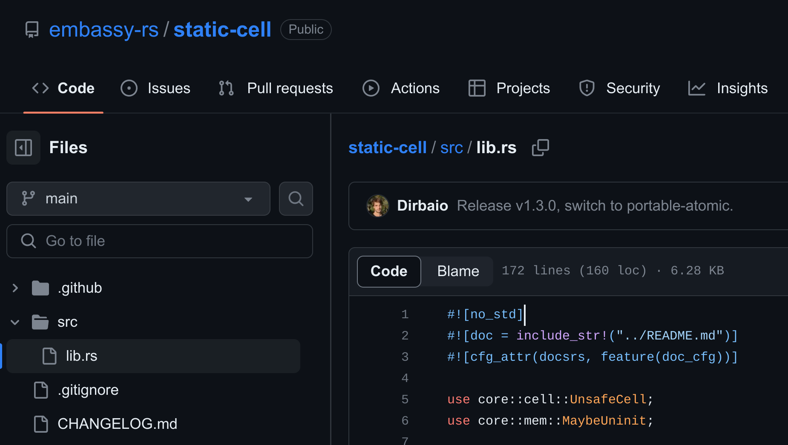


**WARN!** 아직 작성 중인 글입니다. 중도에 내용이 변경될 수 있습니다.



_RIIR BEAM_

## 서론
저번 글에 이어서 러스트를 임베디드에 적용했을 때 얻었던 장단점과 러스트 임베디드의 공부 방법 대해서 간단히 다루려고 한다.

## 러스트를 임베디드에 쓰고 나서 느낀 점

### C언어와 러스트 사이에는 38년의 간격이 존재한다.
 _이미지 출처 : [History Of Programming Languages](https://javaconceptoftheday.com/history-of-programming-languages/)_

C언어는 1972년 발표됐으며, 러스트는 2010년에 발표되었다. 이 사이에는 최소 38년의 간격이 있으며 그 사이에 많은 언어들과 개념들, 변화들이 있었다.

C언어는 구조체 struct가 있긴 하나 **절차 지향**이며 일단은 강타입 언어입니다.
러스트는 C++ 하고는 다른 상속 없는 **객체지향**을 갖고 있는 강타입 언어임과 동시에 C와 C++를 이어서 시스템 프로그래밍을 고려한 언어입니다.

개인적인 해석에 있어서 C언어가 강타입이긴 하지만 CPU 레지스터에 강하게 바인드 되는 언어라고 생각합니다. 그에 비해 러스트는 C언어보다는 덜 CPU 레지스터에 종속되지만 그래도 경우에 따라 CPU 레지스터를 의식하고 프로그래밍할 수 있으며 "객체"의 개념에 있어서 강타입 속성을 갖고 있다고 생각합니다.

C언어는 오래동안 유지되어 왔으며, 임베디드만 한다고 하면 C언어는 매우 유창하게 구사할 수 있으나 현대 언어인 러스트를 적응할 때에 많은 문제가 있을 수 있습니다. 가장 큰 문제가 "객체" 와 "메서드"설계하는 것일 겁니다. 절차 지향만 여태 해왔다 한다면 최소 몇 개월은 이 문제로 많은 어려움이 있을 수 있습니다.

이 외에도 nullable 을 명확하게 구분하려는 철학, 소유권 등의 생각보다 기존의 생각의 틀에서 깨야 할 것들이 많습니다. 이걸 이해하고 특히 로우 레벨 제어에서 가끔 이것들을 깨고 프로그래밍하거나 (unsafe) 프로그램 용량을 고려해서 튜닝을 하는 과정에 있어서 CS 지식? 과 철학을 많이 얻을 수 있다고 생각하며 이것이 가장 값지다고 생각합니다.

### 임베디드(펌웨어) 프로젝트에 적용 시 장점
- 언어 스펙상으로 내장된 Test 덕에, 부분적으로 Unit Test를 짜기 용이하다.
- 로직 생으로 문제없고 Unit Test가 거들어준다면 Integration Test를 매우 적게 하고 버그를 잡을 수 있었다.
- 썼던 코드 어느 정도 그대로 백엔드 서버에 적용할 수 있었다.
- clippy, fomatter가 기본으로 내장되어 불필요한 코드나 코드 컨벤션을 통일하기 좋다.
- (상속 없는) 객체지향 덕에 코드 재활용이 유용하다.
- Cargo 생태계 덕에 라이브러리를 추가하기 정말 편하다. 툴체인 설정도 매우 간단하다.
- 펌웨어에서 `epoll` 이 아닌 `async / await`를 사용할 수 있다.
- 절차형 매크로를 사용할 수 있다.
- C로 짠 것보다는 안전하며 개발 과정 중에 실수를 많이 줄일 수 있다.

### 임베디드(펌웨어) 프로젝트에 적용 시 단점
- 아직 참고할 프로젝트가 많이 없다.
- 8비트 프로세서는 아무래도 적용하기 힘들다.
- Queue나 array에 데이터를 넣을 때는 아무래도 사이즈를 최대한 줄이기 위해 enum, option, struct 등을 더 작게 만든 별도의 타입을 지정하게 된다. 이때 Into/From을 만드는 것이 조금 번거롭다.
- nightly feature을 어느 정도는 고려를 해야 한다.
- Ghidra/objdump로 컴파일 된 바이너리를 볼 때 기존의 C 코드와 결이 은근히 많이 다르다. (어셈블리 단위 정적 분석하기 아직까진 힘들다. 이건 단점이기보다는 특징이다.)
- 객체지향에 대한 경험이 없다면, 절차 지향적인 러스트 코드를 만들 수 있다.

### 이렇게 단점이 많은데 써야 하나요?
결국에는 각 개인, 조직의 선택이긴 하나, 저는 썼으면 좋겠습니다.

그 이유는 백날 C언어만 고집할 수는 없다고 생각하며 아무리 제조업/로우 레벨의 특수성이 존재한다고는 하나, 임베디드 개발 자라고서 개발자의 범주에서 벗어나는 것은 아닙니다. 현재 전체적인 범주에서의 개발자들이 사용하는 언어는 많이 발전해 왔고 계속 변경되고 있습니다. 제조업/로우 레벨 쪽이라고 해서 이 현대의 흐름을 벗어날 수 없으며, 계속 피한다면 이쪽 업계로 사람이 언젠가는 끊길 것이라고 생각합니다.

물론 C언어를 완전히 버릴 수는 없습니다. 하지만 많은 C언어 개발자들이 리눅스 커널 코어 코드처럼 매우 견고하고 매우 빠른 코드를 짤 수 있는 것은 아니니까요.

## 러스트 공부

### 글 선택
가능하면 러스트를 처음 접하는 사람들을 위하여 C언어 개발자 입장에서 알아두면 좋은 러스트 문법을 소개하고 싶으나 이미 김기와 님께서 좋은 글[평범한 C 개발자의 Rust 입문기: Rust에 입문하는 C 개발자를 위한 안내서](https://wikidocs.net/book/12811)을 남겨주셔서 인용을 남겨두고자 한다.

이 외에도 아래에 있는 설명들이 러스트의 문법들을 잘 설명하고 있다.

- [The Rust Programming Language 한국어 번역](https://rinthel.github.io/rust-lang-book-ko)
- [Comprehensive Rust 한국어](https://google.github.io/comprehensive-rust/ko/index.html)
- [평범한 C 개발자의 Rust 입문기: Rust에 입문하는 C 개발자를 위한 안내서](https://wikidocs.net/book/12811)

### 공부 방식
러스트 임베디드를 목표로 공부를 한다고 하면, 곧바로 MCU나 리눅스 드라이버를 개발을 하는 것은 별로 좋은 선택지는 아니다.
우선 임베디드라고 하면 대략적으로 3가지 방향성이 있다.
1. "MCU에서 돌아가는 펌웨어 개발"
2. "커널 개발 혹은 커널 드라이버 개발"
3. "FPGA 개발"

여기서 다루는 것은 1번 "MCU에서 돌아가는 펌웨어 개발"이며, 2번에 대해서는 차후 개인 공부와 실무에서 해본 다음에 따로 서술할 예정이다. 하지만 엄밀히 말하면 서로의 지식이 도움이 되는 도메인이긴 하나 전혀 다른 도메인이다. 특히 3번은 더더욱 다른 도메인이다.

(러스트로 FPGA에 적용하는 사례가 있어서 넣긴 했으나 HDL 류를 잘 몰라서 앞으로 언급은 하지 않는다.)

1번과 2번의 목표를 잡고 했을 때 도메인 외에 러스트 언어만 한정 지어서 공부해야 할 것이라고 하면 언어 자체를 일단 공부해야 한다.

우선은 위에 언급한 좋은 자료들을 보고 OS 위에서 돌아가는 토이 프로젝트를 먼저 잰 행 해보기를 권장한다.

언어는 도구에 불구하기에 곧바로 알고 있던 도메인에 적용하려는 시도가 있으나 장기적으로 본다면 별로 좋은 선택지는 아니라고 생각한다. 이렇게 생각하는 이유에 대해서는 다른 섹션에서 다루도록 하겠습니다.

### `no_std`를 의식할 것
`no_std`는 땜쟁이에게 러프하게 비유하자면 `non-eabi` 같은 것이다. 풀어서 설명하자면 OS에서 제공하는 표준 API 없이 돌아가는 환경을 말한다. 이 경우에 heap 혹은 dynamic allocation과 같은 부분에 있어서 많은 제약을 가지며 표준 입출력이 없기에 OS 위에서 개발하던 때와 달리 하드웨어적인 부분을 고려하여 개발을 할 수밖에 없다.



`no_std`는 rustc (컴파일러)한테는 예약어이며, cargo (패키지 매니저)에서는 암묵적인 예약어이다. 라이브러리의 `lib.rs` 초입부에 `#![no_std]`라고 표기가 되어있다면 이 라이브러리는 `no_std`환경에서 사용할 수 있다.


이 외에도 [crates.io](https://crates.io/)에 올려서 `no_std`라는 것을 홍보하기 위해서 `Cargo.toml`에 `no_std`를 표기해두는 경우도 있다.

- [A `no_std` Rust Environment](https://docs.rust-embedded.org/book/intro/no-std.html)

앞으로 러스트 임베디드 위에서 개발하게 된다면 1번 2번의 경우 둘 다 `no_std` 라이브러리를 작성하거나 가져와서 쓰는 경우가 많아진다. 왜냐면 우리가 삼는 타깃은 운영체제의 지원에 대해서 매우 제약적이기 때문이다.

#### 코어 라이브러리를 사용할 때 `std`대신 `core`사용
```rs
use core::borrow::BorrowMut;
use core::cell::UnsafeCell;
use core::marker::PhantomData;
```

우선 당장 신경 쓸 수 있는 부분은 코드를 작성할 때 `std`에서 가져오지 말고 최대한 `core`에서 가져오도록 한다. `std`에는 `core`에 있는 것들을 re-export 하고 있기에 core에 있는 것들로 구성해도 된다.

- https://doc.rust-lang.org/src/std/lib.rs.html#431-459

### 처음에는 최대한 `unsafe`를 쓰지 말자

러스트로 임베디드를 작성하면서 결국에는 최적화를 위해 `unsafe`를 사용했지만 `unsafe`는 사용이 힘들고 C로서 이해하고 있던 프로그래밍 모델, 컴퓨터 구조를 러스트의 철학? 을 답습하며 이해해야 하는 과정이 들어간다. 그리고 가장 큰 문제는 물어볼 수 있는 사람이 줄어든다.

우선은 러스트라는 언어에 대해서 어느 정도 익숙해진 다음 다루는 것을 권장한다.

혹시라도 써야 한다면 아래의 문서가 매우 상세하게 서술되어 있다.

- [The Rustonomicon](https://doc.rust-lang.org/nomicon/)

-------------------------------

이 시리즈의 다른 글도 같이 봐주세요 : 
[러스트 임베디드 양산 제품 개발기](/categories/my-frist-mass-production-with-rust-embedded/)
