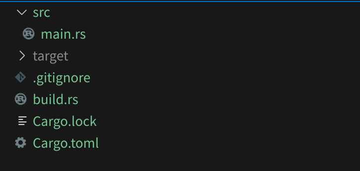


**WARN!** 아직 작성 중인 글입니다. 중도에 내용이 변경될 수 있습니다.



## 읽기 앞서서
이 글은 이전 글 [3 컴파일 타임에 맡기세요](/posts/my_first_commerical_rust_embedded_product_3) 의 연장선이나 const fn/trait/impl 보다는 `build.rs` 에 초점을 맞추어 설명합니다.

rust 문법에 대한 이해가 부족하다면 이전 글 [2탄 기초 공부 방법 및 특징](/posts/my_first_commerical_rust_embedded_product_2/#러스트-공부) 에 적힌 #러스트-공부 문단을 읽고 올 것을 권합니다. 이 외에도 김기오 님이 남겨주신 좋은 글[평범한 C개발자의 Rust입문기: Rust에 입문하는 C개발자를 위한 안내서](https://wikidocs.net/book/12811)또한 추천드립니다.

## 빌드 스크립트 (`build.rs`)
C, C++에는 Makefile이 있듯, rust에는 Cargo가 있다. Cargo는 컴파일 시작 전에 실행할 수 있는 `build.rs`를 간단하게 쓸 수 있도록 제공하고 있다.

자세한 `build.rs`에 대한 설명은 여기서 확인할 수 있다. [The Cargo Book - Build Scripts](https://doc.rust-lang.org/cargo/reference/build-scripts.html)

`build.rs`는 `src` 디렉터리에 있는 소스코드 혹은 외부 라이브러리를 컴파일하기 전에 실행이 된다. 그리고 중요한 점은 `no_std`를 위해 코드를 개발 중이라 하더라도, `build.rs`는 `no_std`뿐만 아니라 `alloc` crate를 비롯한 OS 위에서 사용 가능한 라이브러리를 사용할 수 있다.

별도의 `main.rs`에 있는 프로그램은 const 상수 데이터를 컴파일 타임에 만들어야 하지만, 사용해야 하는 함수 및 메서드가 const 형태로 제공하지 않는 경우가 있다.

### `build.rs` 와 `env!()`로 문자열 가져오기

`build.rs`와 `env!()` 매크로를 사용해 문자열(`&str`)을 컴파일 타임에 가져오는 실습을 해보고자 한다.



프로젝트 구조는 이렇게 구성된다. `main.rs`(혹은 `lib.rs`)는 src 디렉터리에 없으며, 프로젝트 파일의 루트 디렉터리에 들어간다.

#### Cargo.toml 예시
```toml
# End of Cargo.toml
[build-dependencies]
chrono = "0.4.31"
```

위에서 언급한 것과 같이 `build.rs`는 기존에 OS 타겟에서 쓸 수 있는 라이브러리를 사용할 수 있다.
쓰고 싶은 crate가 있다면 dependencies 아래에 `build-dependencies` 리스트에 넣어주자.
아래는 예시를 위한 `chrono` crate를 넣어주었다.

#### build.rs 예시
```rs
// build.rs
fn main() {
    let now = chrono::Utc::now().to_rfc3339();
    println!("cargo:rustc-env=GIVEN_BUILD_TIME={}", now);
}
```

`build.rs`를 Cargo가 컴파일한 뒤 실행하면 chrono 라이브러리를 통해 현재 시간을 UTC로 가져온 다음 `String`으로 만든다.

그다음 "GIVEN_BUILD_TIME" 환경 변수로 `prinln!` 을 통해서 rustc(컴파일러)에 넘긴다.

#### src/main.rs 예시
```rs
// src/main.rs
const BUILD_TIME: &str = env!("GIVEN_BUILD_TIME");

fn main() {
    // if you working with firmware environment,
    // use defmt::info!(..) instead of println!(..)
    println!("passed build time is {}", BUILD_TIME);
    // "passed build time is 2023-11-14T06:14:02.366899222+00:00"
}
```

`src/main.rs`에는 `const &str`로 환경 변수로 존재하는 "GIVEN_BUILD_TIME"을 `env!(..)`라는 내장 매크로를 통해 가져온다.

`env!(..)`의 정확한 모듈 위치는 `core::env!(..)`이며 `core::env!(..)`는 컴파일 타임에 환경 변수를 가져온다.
컴파일 타임이 아닌 OS 위에서 돌아가는 타겟 개발에 있어서 런타임 중의 환경 변수나 실행 인자를 알고 싶다면 `std::env` 모듈에 있는 것들을 사용해야 한다.
`build.rs`를 사용하면서 둘 다 사용하게 될 가능성이 있으니 혼동하지 않도록 주의하자.

`env!()` 매크로에 대한 자세한 설명은 https://doc.rust-lang.org/core/macro.env.html에서 확인할 수 있다.

## 고정길이 바이너리 데이터 만들어서 받아오기
### `include_bytes`를 통해서 받아오기
`core::include_bytes`는 컴파일 타임에 프로젝트 디렉터리에 있는 파일을 바이너리 데이터로 가져올 수 있다.
https://doc.rust-lang.org/core/macro.include_bytes.html

#### 더미 바이너리 생성
```sh
echo -n "\x00\x01\x02\x03" >> ./src/stuff0123.bin
```
실습에서 사용할 더미 바이너리를 생성해 준다. `[0x00, 0x01, 0x02, 0x03]`으로 총 4바이트이며 위치는 `main.rs`가 있는 곳에 넣어준다.

이 글에서는 터미널상에서 더미 바이너리를 만들어주지만 build.rs에서도 할 수 있다.

#### src/main.rs 예시
```rs
const DATA0123: &[u8; 4] = include_bytes!("stuff0123.bin");

fn main() {
    println!("binary data is {:?}", DATA0123);
}
```
`src/main.rs`에는 `const &[u8; 4]`로 아까 생성한 바이너리를 컴파일 타임에 가져온다.
여기서 주의할 점은 위에서 `&str`을 가져온 것과는 다르게 `[u8; N]`과 같이 원자의 개수를 정해줘야 한다.

원자의 개수를 신경 쓰지 않고 가져오기 위해서는 매크로를 사용해서 써야 한다. 이에 대한 내용은 뒤에서 후술한다

## 가변 길이 바이너리 가져오기
| `build.rs`| `src/**.rs`           |
| :-------: | :-------------------: |
| `String`  | `const &str`          |
| `Vec<u8>` | `const [u8; N]`       |

`build.rs`에서는 가변 길이 속성을 가지고 있으나 `src/**.rs`안에서 타겟을 위해서 컴파일 할 때는 proc_macro의 힘을 빌려야 한다.
다만 가변적으로 컴파일할 때마다 데이터의 사이즈가 바뀌는 상황이 철저히 통제되지 않는다면 위험하니 이점은 유의하면서 활용해야 한다.


### proc-macro 사용하여 가변길이 바이너리 받아오기
데이터를 tmp에 저장한뒤 `include_bytes!`와 `proc_macro` 하는 방법도 있으나 여기서 소개할 방법은 `env!` 에다가 `proc_macro`를 같이 사용하는 방법이다.

proc_macro을 서술하기위해서는 과거에 C언어에서 `##`을 사용해 문장을 붙여서 코드를 만들거나 컴파일러 종속 기능을 통해서 흑마법을 부리던것을 토큰과 파서의 개념을 가져와 어느정도 안정적으로 메타프로그래밍할 수 있는 매크로 시스템이다.

한국어로는 절차형 매크로라고 부르며 proc_macro, 절차형 매크로를 잘 활용한다면 뛰어난 메타프로그래밍을 할 수 있다. 여기에 대해서는 차후 다른 글에서 서술하도록 하겠다.

proc_macro의 자세한 공식 설명은 [Procedural Macros](https://doc.rust-lang.org/beta/reference/procedural-macros.html) 에서 확인할 수 있습니다.

#### 전반적인 흐름

stateDiagram-v2
    state "Total flow" as total_flow
    state "data prepare" as data_prepare
    state "hex::encode(..)" as hex_encode
    state "hex encoded" as hex_encoded
    state "passing to env" as passing_to
    state "passing from env" as passing_from
    state "proc_macro" as proc_macro
    state "decoding at build time" as decoding
    state "decoded data" as decoded_data
    state "code generation" as code_generation
    state "src/**.rs" as src_rs
    state "const NAME: [u8; N] = [...]" as const_u8_n 

    state total_flow {
        [*] --> build.rs
        state build.rs {
            [*] --> data_prepare
            data_prepare --> hex_encode
            hex_encode --> hex_encoded
            hex_encoded --> passing_to
        }
        --
        state src_rs {
            passing_from --> proc_macro
            state proc_macro {
                [*] --> decoding
                decoding --> decoded_data
                decoded_data --> code_generation
            }
            proc_macro --> const_u8_n
        }
    }


전반적인 흐름은 아래와 같다.
1. build.rs 에서 넣어줄 데이터를 만든다.
2. hex로 encoding한 뒤 환경변수로 만들어서 rustc에게 건네준다.
3. src/**.rs 에서 환경변수를 받은뒤 proc_macro로 만든 함수로 보낸다.
4. 매크로 함수에서 컴파일 타임에 디코딩을 하여 원본 데이터를 어레이로 만든다.
5. 만든 배열로 지시된 이름으로 const 상수 데이터를 배열의 길이와 함께 코드생성 해준다.

#### 컴파일 타임에 디코딩을 하기위한 proc_macro 코드
위에서 설명한 절차 4, 5번을 행하기 위해서 아래와 같은 코드가 필요하다.

```rs
fn slice_to_auto_sized (
    arr_name: String,
    input: &[u8],
) -> TokenStream {
    format!(
        "const {}: [u8; {}] = [{}];",
        arr_name,
        input.len(),
        input.iter().join(", ")
    )
    .parse::<proc_macro2::TokenStream>()
    .expect("Failed to parse array")
    .into()
}

struct NameAndEnvInput {
    arr_name: syn::LitStr,
    _comma0: Token![,],
    env_var: syn::LitStr,
}

impl Parse for NameAndEnvInput {
    fn parse(input: syn::parse::ParseStream) -> syn::Result<Self> {
        Ok(Self {
            arr_name: input.parse()?,
            _comma0: input.parse()?,
            env_var: input.parse()?,
        })
    }
}

#[proc_macro]
pub fn c(inputs: TokenStream) -> TokenStream {
    let inputs = parse_macro_input!(inputs as NameAndEnvInput);
    slice_to_auto_sized(
        inputs.link_section_name.value(),
        inputs.arr_name.value(),
        hex::decode(std::env::var(inputs.env_var.value()).expect("This env not found"))
            .expect("Can't decode hex")
            .as_slice(),
    )
}
```
예시로 `main.rs`에 `slice_to_auto_sized!(SOME_DATA, GIVEN_ENV);` 와 같은 코드가 선언되어있다고 가정하자

`const_from_hex_env`에서는 `NameAndEnvInput`의 구조체 구조에 맞게 "SOME_DATA"와 콤마(,) 그리고 "GIVEN_ENV" 총 3개의 토큰을 가져온다.
이 토큰을 가장 위에있는 `slice_to_auto_sized`에서 가져온뒤, 만들 코드를 생성해주는 방식이다.

- _위 코드는 [fork된 env-to-array 커밋](https://github.com/pmnxis/env-to-array/commit/782c2b265d8a23653321d163ac5cea96c04bc85d) 에서 확인할 수 있습니다. 해당 코드에서는 linker쪽에 더미 섹션을 만들기위해서 개조되어 있어 살짝 다릅니다._
- _해당 코드는 [env-to-array](https://crates.io/crates/env_to_array) crate코드를 살짝 수정한 포크입니다._


#### hex encode를 위한 데이터 생성 예시
```rs
fn main {
    // https://github.com/pmnxis/billmock-mptool/blob/master/otp-proof-of-concept/build.rs
    // 중략
    let fingerprint = MpFingerprint {
        firmware_fingerprint: FirmwareFingerprint {
            model_name: main_package.name.clone(), // reference package name temporary
            model_ver: feature_based_model_ver,
            firmware_ver: main_package.version.to_string(),
            firmware_git_hash: format!("{}", commit_hash),
        },
    };

    // cargo objdump --release -- -s --section .mp_fingerprint
    println!(
        "cargo:rustc-env=MP_FINGERPRINT_TOML_HEX={}",
        fingerprint.to_hex_string(),
    );
}
```
hex스타일로 encoding할때는 [hex](https://crates.io/crates/hex)를 사용해 "hex::encode()" 로 인코딩할 수 있습니다.

위 코드에서는 toml로 현재 패키지의 정보와 git hash를 만든뒤 hex로 인코딩해주고 있습니다.

## 실제 응용

### 응용 - EUC-KR 문자열을 컴파일 시간 내에 가져오기
```rs
use encoding_rs::EUC_KR;

fn main() {
    // encoding_rs::Encoding::encode(..) is not const fn
    let ret: &[u8] = EUC_KR.encode("안녕하세요").0.to_vec().as_slice();
}
```

[billmock-app-rs](https://github.com/pmnxis/billmock-app-rs)를 개발하면서 NDA 쪽 금융사 전문 통신 라이브러리를 만들 때, 몇 가지 문제점이 있었다.
EUC-KR의 문자열들을 const로 갖고 있어야 했다. 하지만 EUC-KR 문자열 인코딩 라이브러리 [encoding-rs](https://crates.io/crates/encoding)는 const 한 함수를 제공해 주지 않는다.

EUC-KR도 결국 문자열 인코딩이기에, 문장만 사전에 정해진다는 가정하에 컴파일 타임 안에 만들 수 있는 바이너리 데이터이다.

위에서 소개한 기법들을 조합하여 금융사 전문 통신 라이브러리에서 EUC-KR을 컴파일 타임에 `const [u8; N]`으로 변환해 주는 코드를 작성하였다.

### 응용 - dummy ELF header
펌웨어 개발을 하면서 MP Tool (Mass Production Tool)을 만들어 펌웨어를 대량으로 넣을 때에 실수 방지 및 하드웨어에 대한 버전 기록을 위해 ELF에 더미 헤더를 넣었다. 이때 ELF 더미 헤더는 실제로 flash에 적재되지 않는 데이터로서 가변 길이를 사용해도 아무런 문제가 없었다.

전반적인 구조는 위에서 서술한 [proc-macro 사용하여 가변 길이 바이너리 받아오기](#proc-macro-사용하여-가 변 길이-바이너리-받아오기) 내용과 비슷하다.

관련된 커밋은 아래와 같다.

- https://github.com/pmnxis/billmock-app-rs/pull/42/files
- https://github.com/pmnxis/env-to-array/commit/782c2b265d8a23653321d163ac5cea96c04bc85d

## 마치며
이 글은 이전 글 [3 컴파일 타임에 맡기세요](/posts/my_first_commerical_rust_embedded_product_3) 의 연장선이나 const fn/trait/impl 보다는 `build.rs` 에 초점을 맞추어 설명을 하였다.
`build.rs`를 통해 고정길이, 가변길이를 다루는 법과 실제 사용 예시를 나열했다.

도중에 proc_macro (절차형 매크로) 에 대해서 설명하기에는 내용이 너무 길어지기에 다음 기회에 서술할 예정이다.